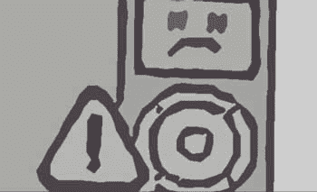

# 苹果 iPhone 4S/5 谣言:什么是对的，什么是错的，什么是疯狂的

> 原文：<https://web.archive.org/web/https://techcrunch.com/2011/10/04/apple-iphone-4s5-rumors-what-was-right-wrong-and-just-plain-crazy/>

在任何苹果活动之前，谣言和猜测都会泛滥，而且最常见的情况是，宣布的产品并不像宣传的那样。这就是今天发生的事情。苹果谣言工厂承诺 iPhone 5 具有杀手级的规格，巨大的屏幕和内置的传送设备。我们换成了 iPhone 4S。以下是互联网的对错。

* * *

## ** 正确的谣言**

**丰富的语音控制**

它叫 Siri。苹果公司认为这些语音控制基本上是个人电脑的下一个范例。不过，安卓用户会叫苦不迭，因为他们选择的手机操作系统早就有类似的功能了。我们也不会惊讶地看到微软粉丝发表了一些评论，因为芒果也有一些非常广泛的语音控制功能。

**双模 GSM/CDMA 收音机**

苹果解决了令人沮丧的供应链问题，并为 iPhone 4S 使用了双模 GSM/CDMA 无线电。这使得苹果只能生产、分销和销售一种型号。在 iPhone 4S 的小框架中安装多个天线可能不是一件容易的事情。

**下一代 iPhone 将搭载 A5 CPU**

苹果在 iPad 2 中首次推出了双核 A5 CPU。它现在是 iPhone 4S 的核心，CPU 处理任务的速度是它的两倍，图形处理速度是它的七倍。愤怒的小鸟再也不会是原来的样子了。

**800 万像素摄像头**

这只是一张平淡无奇的寿司的无辜照片。然而，这张照片让苹果粉丝陷入了疯狂，他们通过简单的数学运算声称 iPhone 5 将拥有 800 万像素的传感器。iPhone 5 今天没有发布，但 iPhone 4S 实际上配备了一个 800 万像素的传感器，比 iPhone 中使用的 500 万像素摄像头多 60%。苹果然后用五元素镜头覆盖它，并声称 A5 CPU 允许 26%更好的自动白平衡。

* * *

## ** 错误的谣言**

**iPod 被放在砧板上**

菲尔·席勒，“我很高兴能和你谈论 iPod。我们开发 iPod 仅仅是因为我们热爱音乐。我们仍然热爱音乐，我们仍然在制造伟大的 ipod”，然后继续介绍 iPad nano 和 touch 的更新。iPod 没有死。还没有。

**苹果将发布 iPhone 4S 和 iPhone 5**

直到上周末，占主导地位的谣言涉及 iPhone 4S 和 iPhone 5。iPhone 4S 将是一款更新的 iPhone，而 iPhone 5 将采用受 iPad 启发的设计，配有更大的屏幕和更薄的外壳。苹果公司今天刚刚发布了 iPhone 4S。

**梦幻组合:脸书和苹果**

在 iPad 应用缺席脸书的 F8 发布会后，[一份独家报道浮出水面](https://web.archive.org/web/20230203093011/http://mashable.com/2011/09/26/facebook-ipad-app-iphone-app-exclusive/)称脸书期待已久的应用将与重新设计的 iPhone 应用一起在苹果的“iPhone 5 发布会”上发布。今天显然没有发生这种情况。然而，在 Mashable 的辩护中，iPhone 5 也没有在今天推出。

**iPhone 4S 将会是一款更便宜的 iPhone**

苹果有机会通过推出更便宜的 iPhone 彻底摧毁竞争对手。但这是不可能的。最新款的 iPhone 将和之前的版本一样，以 199 美元的价格上市。

**大屏幕**

几个月前，通过泄露的案例，有传言称下一代 iPhone 将会更宽更高。这引发了一个合乎逻辑的结论，即下一代 iPhone 将拥有更大的屏幕。这些保护套仍有可能确实是为 iPhone 5 准备的，iPhone 5 将在晚些时候推出，屏幕更大。

**窄边玻璃**

据传，iPhone 4 将推出窄边框玻璃。这并没有发生，也没有成为 iPhone 4S 的卖点。或许苹果是在为 iPhone 5 保留这一点。

**新的主页按钮**

泄露的挡板讲述了一个重新设计、加长的 home 键的故事。据推测，这个更长的按钮将允许手势，甚至多点触摸选项。但是今天发布的手机，iPhone 4S，具有久经考验的真正的圆形 home 键。

* * *

## **疯狂的谣言**

**冲刺独占性**

据报道，Sprint 将公司押在了下一代 iPhone 上。一些报道甚至认为 Sprint 将独家获得下一代 iPhone。尽管 iPhone 4S 将与威瑞森和 AT&T 一起冲刺，但这并没有发生