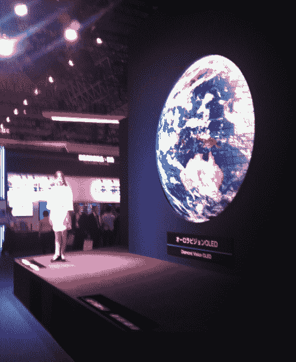

# CEATEC 2011:三菱展示半球形显示屏(直径 2.7 米)

> 原文：<https://web.archive.org/web/https://techcrunch.com/2011/10/04/ceatec-2011-mitsubishi-showcases-semispherical-display-2-7m-diameter/>

# CEATEC 2011:三菱展示半球形显示屏(直径 2.7 米)

CEATEC 2011 展览今天在千叶(就在东京郊外)开幕，我看到的要么令人失望(比如已经在*商店*出售的装备)，要么已经被广泛报道，因为大多数日本公司预先宣布了几乎所有的新产品(例如， [Docomo 令人敬畏的智能手机外套](https://web.archive.org/web/20221202091237/https://beta.techcrunch.com/2011/09/22/ntt-docomos-cases-make-smartphones-measure-radiation-body-fat-alcohol/))。

一个例外是三菱所谓的“钻石视觉有机发光二极管”，一个直径为 2.7 米的半球形显示器。它与目前在东京国家新兴科学和创新博物馆展出的巨大的有机发光二极管地球仪非常相似。

这款新机型由 696 块有机发光二极管面板组成，每块面板的尺寸为 32 x 32mm 毫米。尺寸为 96 x 96mm 毫米，形成上述球体的 OLEDs 要大得多，但面板共享相同的像素间距(3 毫米)。

三菱公司表示，钻石视觉有机发光二极管的亮度为 1200 CD/m2，功耗为 11.2kW。该公司计划将数字标牌系统的显示器商业化。