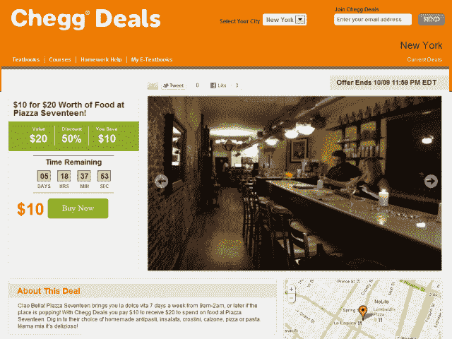

# 注意，学生团体商务现在为“Chegg Deals”提供动力

> 原文：<https://web.archive.org/web/http://techcrunch.com/2011/10/04/heads-up-students-group-commerce-now-powers-chegg-deals/>

# 注意了，学生们——集团商务现在为“齐格网交易”提供动力

**独家——**全美国的学生欢欣鼓舞，因为 [Chegg](https://web.archive.org/web/20230205035740/http://www.crunchbase.com/company/chegg) 正在进入与 [Chegg Deals](https://web.archive.org/web/20230205035740/http://www.cheggdeals.com/) 的日常交易空间，这是由白标[团购平台](https://web.archive.org/web/20230205035740/http://www.groupcommerce.com/)公司[集团商务](https://web.archive.org/web/20230205035740/http://www.crunchbase.com/company/group-commerce)提供的。

这两家公司合作为学生提供全国范围的折扣，从宿舍必需品到当地餐馆，以及教科书和其他教育资源。

两家公司在一份联合声明中表示，该项目最初在坦佩、迈阿密、亚特兰大和纽约推出，未来将扩展到向全国学生提供有针对性的交易。

集团商务首席执行官 Jonty Kelt 说:

> “学生每年花费超过 2000 亿美元，我们相信这是一个严重得不到充分服务的人群——齐格网对此非常了解。”

Chegg 表示，它已经与 Capitol One、Dr. Pepper、MTV、Livescribe 和微软等品牌建立了合作关系。

这听起来的确是个好主意。由于与集团商务的交易，Chegg 不需要建立自己的团购平台，但仍然可以利用其品牌建立一个利基日常交易网站。此外，学生非常适合利用团购。

根据齐格网的数据，目前美国有 1600 万大学生，另有 1500 万高中生。

