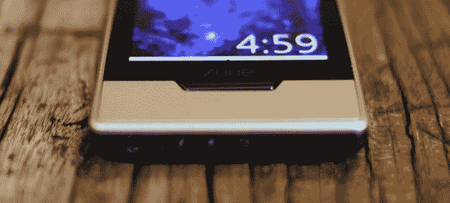

# 微软将 Zune 放入内存洞 TechCrunch

> 原文：<https://web.archive.org/web/http://techcrunch.com/2011/10/04/microsoft-puts-the-zune-down-the-memory-hole/?utm_source=feedburner&utm_medium=feed&utm_campaign=Feed%3A+Techcrunch+(TechCrunch>)

# 微软把 Zune 放进了内存洞

我们已经知道 Zune 是 T2 的翻版，是 mp3 播放器，而不是服务，但是直到最近，你仍然可以通过访问微软的 Zune 页面，看着所有的 Zune 硬盘在后台嬉戏，沿着记忆的轨迹漫步。不再是了。Zune 本身已经被从 [Zune 页面](https://web.archive.org/web/20230203152705/http://www.zune.net/)中删除，新的玩家将不再产生。

其实早就应该了。Zune 的主要生态系统很久以前就转移到了 Windows Phone 7，在一个应该吹捧新手机比旧的专用播放器好得多的页面上停止硬件似乎很奇怪。即使严格来说这不是真的。

由于我在每次写 Zune 时都有微软的合同义务(披露:我没有任何人的合同义务做任何事情)，我爱我的 Zune HD，并且仍然每天使用它。但我知道这是一个遗物，我希望 WP7 手机的媒体功能能够像 Zune HD 一样强大。尽管这一次他们可能会考虑不那么不透明的广告策略。

微软会再次尝试 Zune 吗？我真的会说是的，但不会很快。Windows 8 可能会利用 Zune 的功能进行媒体播放，在平板电脑操作系统稍微改进后，它的精简版可能会出现。但是现在，根据 Zune 支持页面，玩家们都走了。[via [winrumors](https://web.archive.org/web/20230203152705/http://www.winrumors.com/microsoft-confirms-zune-death-we-will-no-longer-be-producing-zune-players/)

> 我们最近宣布，从现在开始，Windows Phone 将是我们移动音乐和视频战略的重点，我们将不再生产 Zune 播放器。那么这对我们现在的 Zune 用户意味着什么呢？完全没有。你的设备将继续使用 Zune 服务，就像现在一样。我们将继续为当前用户和购买我们最后一批设备的用户提供所有设备的保修服务。客户服务一直是并将继续是我们的重中之重。要充分利用 Zune 播放器或获得更多支持，请访问以下网站:

和往常一样，这个有趣且超前的微软财产的命运(真的不考虑 Zune 硬件的失败)是朦胧的。但是，也许通过将过去抛诸脑后，微软正准备迈出下一步。