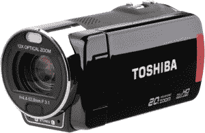

# 东芝在假期及时发布 3 款新 Camileo 摄像机 TechCrunch

> 原文：<https://web.archive.org/web/http://techcrunch.com/2011/10/04/toshiba-releases-3-new-camileo-camcorders-in-time-for-the-holidays/>

# 东芝在假期发布了 3 款新的 Camileo 摄像机

东芝今天宣布，他们的三款新 Camileo 摄像机将于本月上架。这三款相机都有一些共同的功能:例如，它们都配备了可旋转的 3 英寸液晶触摸屏、屏幕视频微调和传统的桶形设计。

这些不是你在这里看到的唯一相似之处。Camileo X400 和 X416 几乎是双胞胎，因为他们几乎相同的身体和规格表。它们都配备了 23 倍光学变焦镜头、电子图像稳定和用于麦克风的外部热靴。哦，以免我忘记，他们也都拍 1080p。事实上，它们唯一不同的地方是它们的储物选项。

虽然这两个版本都可以使用全尺寸的 SD 卡，但 X416 还配有 16 GB 的板载存储。如果你喜欢看的话，这相当于 3 个小时的 1080p 高清视频。X400 将花费您 279 美元，而 X416 的内存提升使其标价为 319 美元。

X200 在这里意味着钱包友好型，这也是事实。它也可以拍摄 1080p，但它配备了一个小得多的 12 倍光学变焦镜头，以及少量的艺术拍摄模式。想拍黑白的？没问题。想要捕捉一朵盛开的花，因为它是你生活的隐喻？打开延时模式。钱包友好型 X200 零售价为 229 美元。

如果这些新的摄像机不知何故引起了你的兴趣，它们已经在 ToshibaDirect.com 出售了。否则，你可以等到它们在 10 月 10 日上架。