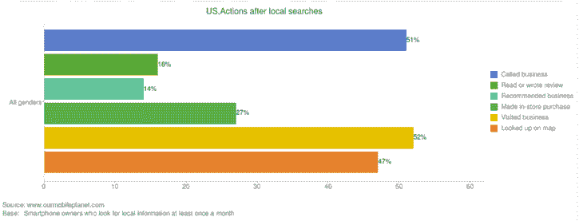

# 谷歌新推出的免费工具“我们的移动星球”对智能手机分析和数据进行了深入研究 TechCrunch

> 原文：<https://web.archive.org/web/https://techcrunch.com/2011/10/05/googles-new-our-mobile-planet-free-tool-offers-a-deep-dive-on-smartphone-analysis-and-data/>

# 谷歌新的免费工具“我们的移动星球”提供了智能手机分析和数据的深度挖掘

谷歌正在推出一款新的数据和分析工具，名为[我们的移动星球](https://web.archive.org/web/20230204214450/http://www.ourmobileplanet.com/)，它让任何人都可以访问关于智能手机使用的数据和研究。该网站有一个互动工具，任何人都可以使用它来根据谷歌今年早些时候进行的“全球移动研究:智能手机用户&移动营销者”报告中的数据创建自定义图表(你可以在这里阅读更多关于数据[)。OurMobilePlanet 深入研究消费者搜索、视频、社交和电子邮件行为，以及移动研究和购买意向。](https://web.archive.org/web/20230204214450/http://www.ourmobileplanet.com/omp/omp_about)

您可以选择想要查看的智能手机数据类型，包括消费者采用智能手机的渗透率、行为(消费者使用这些设备的原因和方式)、活动(消费者在智能手机上做什么)、商业(智能手机上的购买行为)和广告(消费者参与移动广告)。

这些数据集中的每一个都有子集，所以你可以真正深入到具体的研究。例如，在商务下，您可以选择移动商务，通过垂直和报表进行研究和购买。在每一项下，你可以选择一些数据点，包括按支付类型、NFC 等进行的购买。

然后你可以选择按国家过滤数据，谷歌提供来自全球 30 个不同国家的数据。您可以在图表中添加其他过滤器，如年龄、性别和移动互联网使用情况。您可以将图表导出为 JPG、CSV 或 XLS 文件。

显然，该平台提供了大量的数据，你可以获得简单的信息，如某个国家的智能手机普及率，以及更深入的分析，如该国有多少消费者在智能手机上进行本地搜索后访问了商店。

谷歌表示，这是首次免费提供如此广泛的研究。显然任何人都可以使用我们的移动星球。

