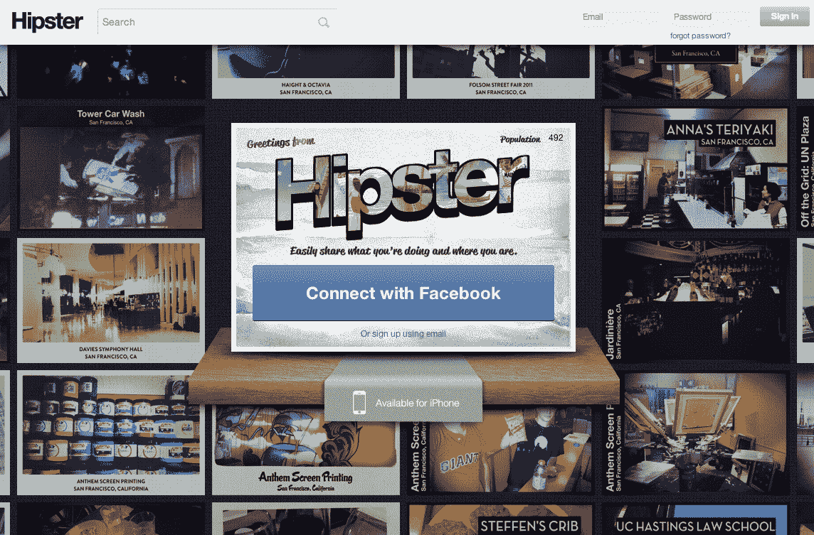
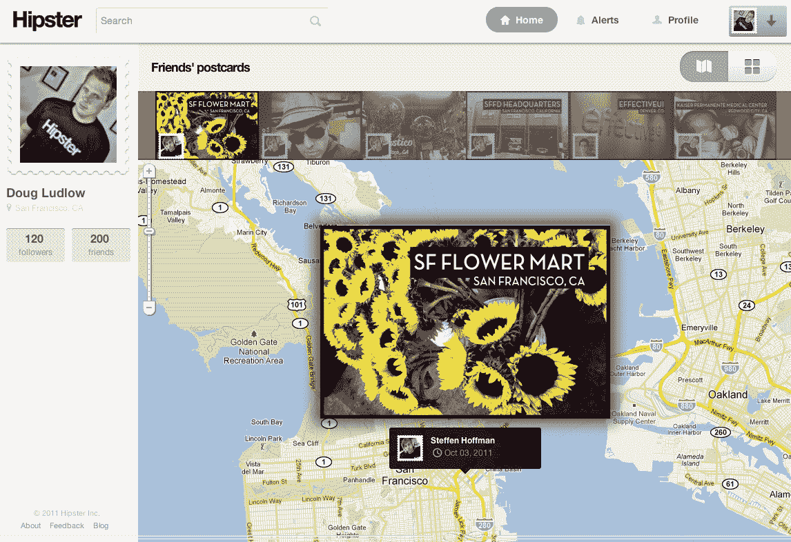

# Hipster 改变策略，现在希望您发送数字明信片 TechCrunch

> 原文：<https://web.archive.org/web/https://techcrunch.com/2011/10/05/hipster-now-wants-you-to-send-a-digital-postcard/?utm_medium=twitter&utm_source=twitterfeed>

我们真的需要另一款基于位置的照片分享应用吗？

[Hipster](https://web.archive.org/web/20230203184808/http://www.hipster.com/) ，一个我已经写了无数次的服务，今天推出了它的第一个对所有人开放的产品——它不是，像我们写的和[许多人预期的](https://web.archive.org/web/20230203184808/https://techcrunch.com/2011/01/17/hipster-2/)，一个本地 Q & A 服务。Hipster 加入了移动社交本地照片分享火车头，并开发了一款应用程序，让人们用手机分享照片。

当被问及上面粗体字的问题时，这可能是任何有逻辑的人在看到产品时的第一个问题，Hipster 首席执行官道格·勒德洛回答说:“发送明信片是 Hipster 非常非常漫长的旅程的第一步，我们决定以有趣、美丽和病毒式的功能开始这次旅程。”

勒德洛表示，该公司的最终目标是捕捉“发生在我们周围地点的最重要的信息、最迷人的人和最有趣的时刻”，并最终希望人们会拿出 Hipster 来了解特定地点周围的故事。他强调，明信片只是一个“楔形特征”，一种让人们实际使用这项服务的方式。

当 Hipster soft 在 SXSW 推出时，注册测试版的 37K 人被承诺“一些很酷的东西即将来到你的城市”，Ludlow 表示，他们一直在迭代的产品，本地问答，明信片和无数其他没有人看到的产品都是为了解决许多服务在尝试本地服务时表现出的孤独问题(颜色是立即想到的一个)。“如果你是大多数定位服务的唯一用户，”他说，“这是一种可怕的体验。”

要发送潮人数字明信片，使用脸书和/或电子邮件登录，重新拍摄或使用已经拍摄的照片，并从十个明信片“主题”中选择一个，这些主题基本上是不同的照片过滤器、字体选择和风格。

该应用程序允许你编辑你的位置，将你正在做的事情和你与谁在一起添加到卡片上，并分享到脸书和推特上。其他时尚用户可以喜欢和评论现在的风景照片。Ludlow 计划在以后的版本中增加通过移动应用程序拍摄人像和查看赞的功能。

若要在 Hipster 上查看照片，只需登录并选择“朋友”即可查看您关注的人的明信片，或选择“附近”查看附近人的附加内容。滑动给定的图像，它就会像明信片一样转过来，显示它的位置和其他数据。你也可以在谷歌地图上看到这些明信片。

当被问及 Hipster 与照片共享领域最受欢迎的竞争者 Instagram 的区别时(除了 Hipster 实际上有一个强大的网络界面这一事实)，勒德洛说，区别因素是 Hipster 对位置的重视，他认为 Hipster 的明信片更多的是一种视觉签到，或“签到进化”，“我不会假装我们与其他 30 种社交媒体服务有很大不同，”他说。“如果我认为我们会颠覆任何东西，那就是 Foursquare 等基于位置的服务。”

拥有来自[米切尔·卡普尔](https://web.archive.org/web/20230203184808/http://www.crunchbase.com/person/mitch-kapor)、[戴夫·麦克卢尔/500 Startups](https://web.archive.org/web/20230203184808/http://www.500startups.com/) 、 [Lightbank](https://web.archive.org/web/20230203184808/http://lightbank.com/) 、 [Google Ventures](https://web.archive.org/web/20230203184808/http://www.googleventures.com/) 和其他人的 100 万美元种子资金，Hipster 计划尝试各种方式来赚钱，包括销售其数字明信片的印刷版本、广告，是的，还有本地交易。