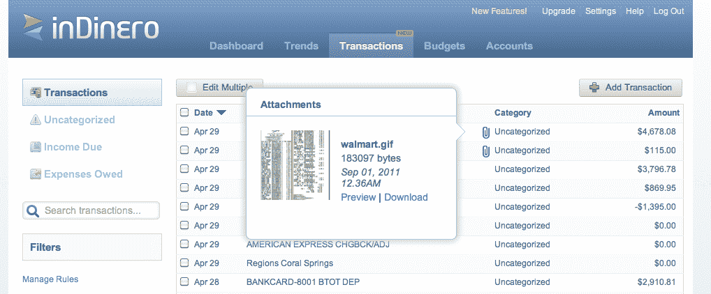

# inDinero 现在允许小企业在一个平台 TechCrunch 上跟踪他们的财务交易和收入

> 原文：<https://web.archive.org/web/http://techcrunch.com/2011/10/06/indinero-now-lets-small-businesses-track-their-financial-transactions-and-receipts-on-one-platform/?utm_source=dlvr.it&utm_medium=twitter>

你认识几个 21 岁的连续创业者？可能不是很多，但现在你会知道一个。Jess Mah 在 13 岁时启动了她的第一个创业项目，这是她在高中时的第二个项目，现在正在进行第三个项目，正如他们所说，这可能就是魅力所在。对于那些不熟悉的人来说，Mah 的第三家创业公司叫做 [inDinero](https://web.archive.org/web/20230204220203/https://indinero.com/) ，它提供软件来帮助小企业实时跟踪和管理他们的财务。不出所料，这家初创公司被贴上了“小型企业造币厂”的标签。

Y-Combinator 支持的初创公司也有一些高调的支持，因为它在去年 9 月从天使投资人那里筹集了 120 万美元，这些天使投资人包括 Yelp 的杰里米·斯托佩尔曼、500 Startups 的戴夫·麦克卢尔、微软的弗里茨·兰曼、Intuit 的吴大维、Slide 的基思·拉博伊斯、YouTube 的贾韦德·卡里姆等。自 2010 年 7 月推出以来，inDinero 已经有超过 20，000 家企业注册使用其服务，如今它正在处理来自这些企业的数十亿美元的收入，并且每月跟踪大约 500 万笔交易。

对于当地企业来说，InDinero 是一个非常漂亮的工具，因为它使初创公司和小企业主能够快速地将信息从他们的财务账户输入到初创公司的仪表板中，此时该服务将获取银行对账单、财务文件等，自动将交易组织到相关的类别中。它甚至会通过其简单的仪表板更新您的预算，由于它已经对您的所有财务信息进行了分类和排序，它可以在几分钟内为您提供最新的一组报告，而无需致电您的会计师。

当然，这里有一个小问题。美国国税局要求小企业跟踪其交易收据，因此 inDinero 今天为希望在一个地方跟踪金融交易和商业收据的业主推出了一项全面服务功能。现在，你不用担心上个月在沃尔玛或亚马逊买了什么，你可以在每笔交易旁边看到完整的收据。

Mah 告诉我们，这里的问题是大多数企业主把他们的收据放在鞋盒里，团队从会计师那里听到了无数的故事，他们看到他们的客户带着装满收据的鞋盒到税务部门进行处理。大多数企业不会跟踪他们在网上购物后获得的电子收据。她说，只要企业家有一个会计系统或 excel 电子表格，还有一盒收据，他们就没有组织好企业财务。解决方案是以自动化的方式将两者合并到一个屋檐下。

因此，inDinero 正在以自动化的方式将这两者融合在一起。此外，这家初创公司现在向用户提供三种方式向 inDinero 发送收据:用户现在可以上传、通过电子邮件或普通邮件向 inDinero 发送收据，此时团队会自动将这些收据与他们财务仪表板上的相应交易进行匹配。如果收据与交易不符，inDinero 将向用户发送电子邮件提醒。

而对用户来说最好的部分呢？收据跟踪是免费的。(当然，inDinero 仍然是免费增值服务。)

会计师也会喜欢这个，因为他们讨厌客户带来一大堆纸质收据。因此，inDinero 将免费帮助他们完成工作。该初创公司将处理所有纸质收据，并自动将它们上传到正确的交易，使用户可以在他或她的仪表板上看到它们。

此外，发送装满收据的最大行李箱的用户将免费获得一年的 inDinero 订阅和一张价值 300 美元的美国运通礼品卡。(尽管这一优惠只持续到 10 月份。)

有了这些新增的功能，没有理由不使用 inDinero。事实上，当我写这篇文章的时候，我正在收集我的纸质收据。那张礼品卡上写满了我的名字。

更多关于 inDinero 的信息，请点击查看 Evelyn 对 Jess Mah 的采访，或者点击访问[《在家创业》。](https://web.archive.org/web/20230204220203/https://indinero.com/)