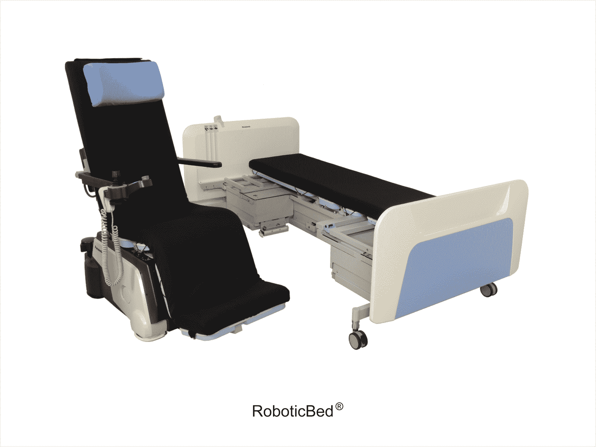

# CEATEC 2011:松下的辅助机器人和令人敬畏的机器人床(视频)

> 原文：<https://web.archive.org/web/http://techcrunch.com/2011/10/07/ceatec-2011-panasonics-assistance-robot-and-awesome-roboticbed-in-action-videos/>

# CEATEC 2011:松下的辅助机器人和令人敬畏的机器人床(视频)

我们已经在视频中向你展示了[松下](https://web.archive.org/web/20230203134846/https://techcrunch.com/tag/panasonic)的酷炫洗头[机器人](https://web.archive.org/web/20230203134846/https://techcrunch.com/tag/robots)，但该公司目前正在日本 CEATEC 2011 技术展上展示另外两个机器人:一个是所谓的 HOSPI-Rimo(两周前我们[报道过](https://web.archive.org/web/20230203134846/https://techcrunch.com/2011/09/27/hospi-rimo-meet-panasonics-cute-assistance-robot/)的辅助机器人)，另一个模型被恰当地命名为 RoboticBed。

下面的视频展示了 HOSPI-Rimo(远程智能和移动/如上图)在 CEATEC 2011 上的应用。概括地说，这种医疗移动机器人应该使卧床不起的病人更容易与住在远处的医生或家人联系(“虚拟访问”):
【YouTube = http://www . YouTube . com/watch？v = lnkkqhbjs 1 I&w = 560&h = 315】

2009 年首次亮相的所谓机器人床其实相当牛逼。

它本质上是一张可以变成电动轮椅的床，反之亦然。松下表示，在 CEATEC 2011 上展示的最新版本比以前的型号“更实用”，也更安全？v = innkuucmq4&w = 560&h = 315】

via[robn able](https://web.archive.org/web/20230203134846/http://www.robonable.jp/news/2011/10/panasonic-1007-2.html)