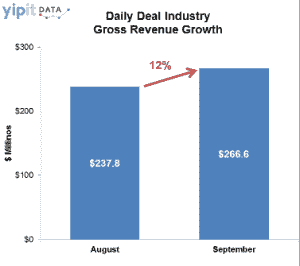

# 由于全食超市的交易，LivingSocial 在 9 月份的增长速度是 Groupon 的五倍 TechCrunch

> 原文：<https://web.archive.org/web/http://techcrunch.com/2011/10/07/livingsocial-groupon-september/>

# 由于全食超市的交易，LivingSocial 在 9 月份的增长速度是 Groupon 的五倍

就总收入而言，LivingSocial 的规模还不到 Groupon 的一半，但在 9 月份，它的增长速度是 Groupon 的五倍，这主要归功于一笔交易:全食超市。根据每日交易跟踪系统的新数据，LivingSocial 在北美的交易总收入在 9 月份增长了 32%，而 Groupon 的增长为 6%。(这两个数字都是与 2011 年 8 月相比的月度增长)。

Yipit 估计，LivingSocial 在 9 月份出售了价值 5930 万美元的交易，环比增长 1460 万美元。其中多达 1000 万美元与一笔非常成功的[全食超市交易](https://web.archive.org/web/20230203153320/http://www.usatoday.com/tech/news/story/2011-09-13/living-social-whole-foods-deal/50387208/1)有关，该交易提供 20 美元购买优惠 10 美元。这正说明了一个受欢迎的全国性交易是如何真正影响日常交易网站的。Groupon 去年在 T4 的 Gap 交易中取得了类似的成功。

即使你不考虑全食超市交易的影响，LivingSocial 在这个月仍然会有 10%的增长。这仍比 Groupon 快，但基数较小。同期，Groupon 在北美的销售额约为 1.434 亿美元。Groupon 在北美的日常交易中保持着 54%的市场份额，而 LivingSocial 为 22 %,自 7 月 8 日以来，这一数字一直徘徊在 7 月 9 日左右。但两家公司都做得很好，根据 9 月份的数据，Groupon 的年总收入为 32 亿美元，LivingSocial 为 17 亿美元。

9 月份，每日交易行业整体增长 12%，总收入估计为 2.666 亿美元，高于 8 月份 9%的增长率。根据 9 月份的数据，整个行业的年运营成本为 32 亿美元(其中 Groupon 为 17 亿美元，LivingSocial 为 7.12 亿美元)。请注意，这些是交易代表的总收入，而不是每家公司在与商家分割每笔交易的价值后获得的直接收入。

Groupon 和 LivingSocial 加在一起占了日常交易行业的 76 %,但是一批新的、小的参与者增长得更快(同样，基数较小)。9 月，排名第三的 TravelZoo 增长了 37%。AmazonLocal 增长了 177%，Google Offers 增长了 236%。直觉告诉我，第三名的位置很快就会改变。