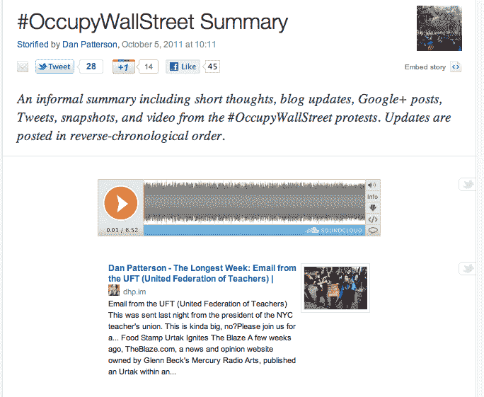

# Storify 增加了 SoundCloud 支持，允许您将音频添加到流中 TechCrunch

> 原文：<https://web.archive.org/web/http://techcrunch.com/2011/10/07/storify-adds-soundcloud-support-lets-you-add-audio-to-streams/>

# Storify 增加了 SoundCloud 支持，允许您将音频添加到流中

音频平台 [SoundCloud](https://web.archive.org/web/20230203071431/http://soundcloud.com/) 和社交媒体故事制作工具 [Storify](https://web.archive.org/web/20230203071431/http://storify.com/) 今天合作，允许将声音与推文、脸书帖子、照片和视频一起收集到 Storify 流中。这则新闻是在 [SoundCloud 被分布式拒绝服务攻击](https://web.archive.org/web/20230203071431/http://status.soundcloud.com/day/2011/10/05)关闭一天后发布的，该攻击导致服务离线和不稳定超过一天。(现在恢复了，应该可以走了。)

SoundCloud 通常被认为是一种服务，它允许未签约的音乐家、DJ 和音乐爱好者在线托管他们的歌曲，将它们发布到社交网络和朋友，并关注其他用户。然而，SoundCloud 不仅限于托管音乐，它可以支持任何类型的声音，包括语音。

因此，SoundCloud 的加入有助于创建 Storify 可以帮助创建的新闻摘要类型的流。例如，[这里有一个总结#占领华尔街抗议](https://web.archive.org/web/20230203071431/http://storify.com/danpatterson/occupywallstreet)的流。在顶部，一个声音云嵌入包括一个记者叙述他所看到的。[这里有一个 SoundCloud 被用于会议报道的例子](https://web.archive.org/web/20230203071431/http://storify.com/journalismnews/a-roundup-of-newsrewired-connected-journalism/)。另一个例子是[采访“普通人”风格报告的主题](https://web.archive.org/web/20230203071431/http://storify.com/openfilevan/doctors-in-vancouver-a-patient-survey)。

当然，SoundCloud 的整合不仅限于新闻报道。[这里是一个音乐比赛](https://web.archive.org/web/20230203071431/http://storify.com/sonicnick/sonic-talk-theme-tune-competition)的 Storify 帖子，作为另一个例子。其他音乐家也可以创建 Storify 摘要，介绍他们的 SoundCloud 曲目在社交媒体上的讨论情况。

[SoundCloud](https://web.archive.org/web/20230203071431/http://soundcloud.com/) 在 [Storify](https://web.archive.org/web/20230203071431/http://storify.com/) 中的集成现已上线。

