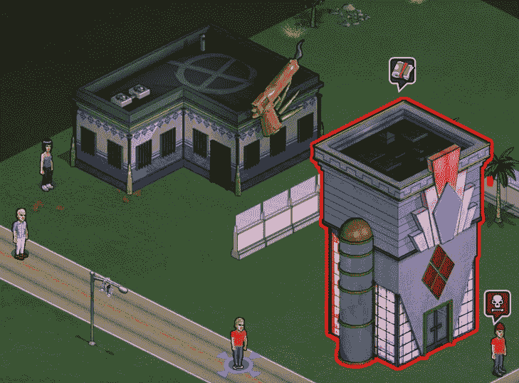

# 脸书黑帮欢欣鼓舞:Zynga 的黑手党战争 2 上线 TechCrunch

> 原文：<https://web.archive.org/web/http://techcrunch.com/2011/10/10/facebook-gangsters-rejoice-zyngas-mafia-wars-2-goes-live/>

# 脸书黑帮欢欣鼓舞:Zynga 的黑手党战争 2 上线

今天是脸书黑手党的好日子。Zynga 的 Mafia Wars 2 最初预计将在未来几周内推出，但该游戏已经在脸书上线，并准备让用户开始构建他们庞大的犯罪帝国。

我们已经在《T2》中深入了解了 Zynga 的第一部直接续作带来了什么，但这里有一个针对老手和新手的快速复习。

首先，还记得最初的黑手党战争是什么样子的吗？算了吧:这款游戏已经进行了大规模的改版。现在你可以在游戏中操纵你凶残的小化身，通过开发你的家园和征服七个不同的世界来进步。你可以把它想象成《城市》和《侠盗猎车手》在小范围内的相遇。

玩家还可以通过在格斗竞技场中竞争来推进游戏，在那里他们与游戏中的对手对抗(有或没有他们的工作人员的帮助)。《黑手党战争 2》比它的前身更注重定制:游戏中有超过 300 种不同类型的武器、盔甲和车辆，玩家可以用它们给黑帮老大和对手带来痛苦。

哦，国际用户会很高兴地知道，游戏一开始就完全支持 16 种语言，所以来自泰国、德国和土耳其的玩家将能够参与这场大屠杀，而不会出现任何问题。

最终，我们只剩下了一个看起来和感觉上都与原版完全不同的社交游戏体验。鉴于 Zynga 最近推出的产品也达到了类似的完美水平，看到他们最古老的产品之一得到急需的彻底改革有点令人欣慰。