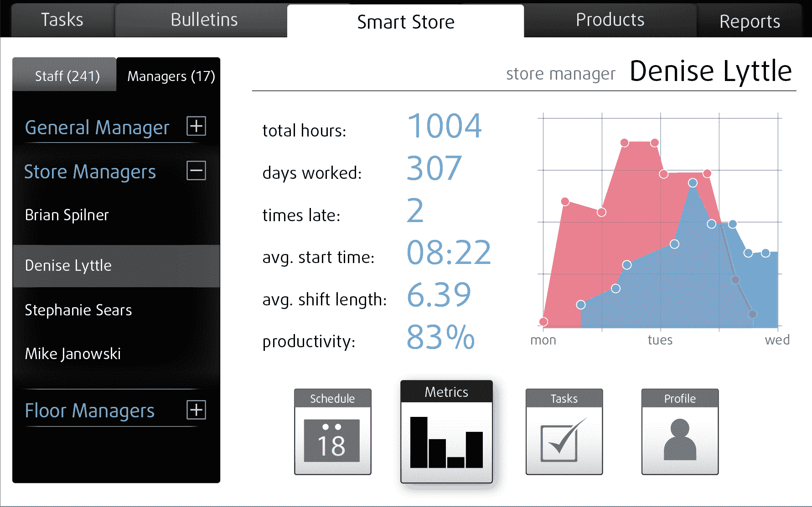
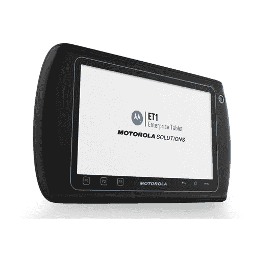

# 摩托罗拉发布 RhoElements，这是一个为企业 TechCrunch 构建移动应用的 HTML5 框架

> 原文：<https://web.archive.org/web/http://techcrunch.com/2011/10/10/motorola-launches-rhoelements-an-html5-framework-for-building-mobile-apps-for-enterprise/>

# 摩托罗拉发布 RhoElements，这是一个为企业构建移动应用的 HTML5 框架

摩托罗拉今天宣布推出基于网络的应用框架 [RhoElements](https://web.archive.org/web/20230203143908/http://support.symbol.com/support/search.do?cmd=displayKC&docType=kc&externalId=13299&sliceId=&dialogID=248088261&stateId=1%200%20248092050) ，这是通过收购跨平台移动应用开发平台 [Rhomobile](https://web.archive.org/web/20230203143908/http://rhomobile.com/) 而实现的。摩托罗拉于 2011 年 7 月 29 日收购了 Rhomobile。

摩托罗拉表示，它计划在未来几个月内为其渠道合作伙伴和客户宣布更多的跨平台开发工具、企业集成组件和基于云的服务。

RhoElements 提供了一个 HTML5/JavaScript/CSS 应用程序框架，支持 HTML5 功能，如应用程序缓存、Web 存储，以及优化网络利用率和在连接丢失时实现连续操作的能力。

该框架是今年早些时候收购 Rhomobile 后出现的第一个产品。这个特殊的工具包是专门针对那些在企业和摩托罗拉的“合作伙伴能力”生态系统中工作的开发人员的。

借助 RhoElements，企业将能够在现有的摩托罗拉 Windows Embedded Handheld(以前的 Windows Mobile)和 Windows Embedded Compact (Win-CE)设备上开发和部署基于 Web 的应用程序。它还将与新发布的基于安卓系统的摩托罗拉 ET1 企业平板电脑兼容。

【T2

ET1 是一款 7 英寸、1.4 磅的加固型平板电脑，运行 Android 2.3，提供 1GHz 双核处理器、8 GB 内部存储空间(可通过 microSD 扩展至 32 GB)、1024 x 600 分辨率的大猩猩玻璃屏幕、800 万像素后置摄像头和前置摄像头，以及可选的蓝牙连接条形码扫描仪和磁条阅读器、热插拔电池和安全系统软件。

这款平板电脑将于今年第四季度上市，售价将低于 1000 美元。

同时，RhoElements 现在可以从[这里](https://web.archive.org/web/20230203143908/http://support.symbol.com/support/search.do?cmd=displayKC&docType=kc&externalId=13299&sliceId=&dialogID=248088261&stateId=1%200%20248092050)下载。