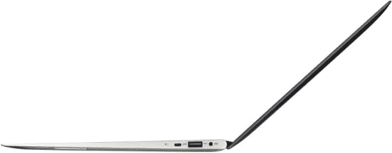
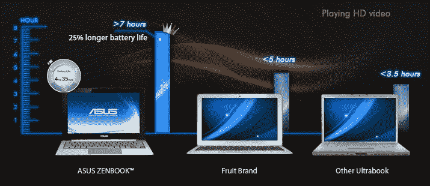

# 华硕 Zenbooks 加入超极本竞争，起价 999 美元 TechCrunch

> 原文：<https://web.archive.org/web/http://techcrunch.com/2011/10/11/asus-zenbooks-enter-the-ultrabook-fray-starting-at-999/>

# 华硕 Zenbooks 进入超极本领域，起价 999 美元

超廉价超极本的承诺还没有完全实现，但这并不意味着我们不能在新机器上市之前拥有一些性感的机器。宏碁的 [Aspire S3](https://web.archive.org/web/20230205044946/https://techcrunch.com/2011/10/10/acer-announces-the-core-i5-aspire-s3-ultrabook-available-this-week-for-the-ultra-bargain-of-899/) 昨天下线了，我们很快就会有一个评测，但是之前有传言和图片的但今天才实际发布的新的华硕 Zenbooks，是我一直在等待的。

你有两个基本型号:11.6 英寸的 UX21 和 13 英寸的 UX31。但是还有更多，更多。

这两款笔记本电脑都有 4GB 的内存，Bang 和 Olufsun 音频系统，USB 2 和 3，微型 HDMI 和 mini VGA 输出。UX21 售价 999 美元，配有酷睿 i5-2467M 移动处理器，可以升级到 i7，售价 200 美元。它的 11.6 英寸屏幕是常见的 1366×768。唉，你被 128GB 的空间困住了。

不过，UX31 看起来是值得拥有的:只需多花一个本杰明(也就是说，总共 1099 美元)，你就可以得到一个更好的 1600×900 13.1 英寸屏幕，一个更好的 i5 处理器(2557 米)，一个 SD 读卡器，和一个更大容量的电池。它也可以升级:你可以多花 250 美元买一个 256GB 的硬盘，然后再花 100 美元买一个 i7。

正如我们所知，它很薄很轻:前部为 0.11 英寸，后部为 0.67 英寸。箱子是铝制的，盖子上有一个漂亮的拉丝设计。UX21 重 2.43 磅，UX31 略重 2.86 磅。与最大的竞争对手(S3，当然还有 MacBook Air)相比，它的制造质量如何将不得不在一些实践时间之后决定。

**更新**:他们的续航对比页面挺搞笑的:

