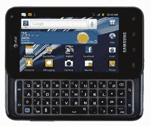
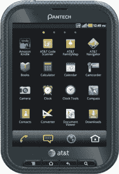
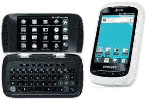

# 美国电话电报公司在其产品线中增加了五款新的 Android 手机

> 原文：<https://web.archive.org/web/https://techcrunch.com/2011/10/11/att-adds-five-new-android-phones-to-their-lineup/>

如果你认为美国电话电报公司的 Android 阵容有点欠缺，那么今天的宣布正好可以改变你的想法。美国电话电报公司已经拉开了五款新的安卓智能手机的帷幕，这些手机将会在节日的骚动中及时上市。

 新的三星 Captivate Glide 可能与它的远亲同温层和史诗般的 4G 有相似之处，但这种相似之处纯粹是表面上的。虽然这款姜饼手机配备了类似的 4 英寸 Super AMOLED 显示屏，但它还配备了双核 1GHz Nvidia Tegra 2 处理器和 1GB RAM，以帮助保持平稳运行。

正如你所知，它还配备了一个看起来舒适的四行键盘，但可能不太明显的是 HSPA+收音机，一个 800 万像素的后置摄像头和一个 130 万像素的前置摄像头。

就升级而言，摩托罗拉的心房 2 实际上看起来是一个大杂烩。它比它的前身更时尚，更不用说一个新的 HSPA+收音机，所以用户终于可以挑战 AT & T 的 Faux-G 网络的极限。

一个未命名的 1GHz 双核处理器正在发号施令，考虑到他们对最初的 Tegra 2 芯片组有多么自豪，这有点奇怪，显示器已经提升到 4.3 英寸，分辨率没有类似的提升。这一点拉伸意味着 Atrix 2 的像素密度比原始模型略低，这可能会让当前的 Atrix 粉丝失望。它确实运行姜饼，一个 800 万像素的摄像头能够拍摄 1080p 视频。

 这两款是 AT & T 产品组合中的重量级新成员，但我们不要忘记该公司新的中低端选择。

泛泰带着他们的姜饼动力口袋加入了这场战斗。它沿用了泛泰其他手机的一些设计语言，这是我礼貌地说它太方了。

它有一个 4 英寸的 SVGA 显示屏，一个 2GB 的 microSD 卡和一个 500 万像素的后置摄像头。这个口袋名副其实，将所有东西都塞进了一个只有 11.3 毫米厚的超薄框架中，所以即使是你们当中的紧身牛仔裤迷也应该不会有太大的麻烦来随身携带这个东西。

 三星 DoubleTime 获得了一个可疑的荣誉，成为这里唯一一款坚持使用 Android 2.2/FroYo 的手机。真的吗？连中兴都有姜饼？

无论如何，DoubleTime 的大噱头是其翻盖设计和安装在上半部分两侧的内部和外部触摸屏。它采用 600MHz 高通处理器，配有 2 GB microSD 卡，只有白色和粉色装饰可选。

中兴制造的 AT & T Avail 是该公司第二款预付费 Android 设备。就智能手机而言，它相当乏味:它配有 3.5 英寸的触摸屏和 500 万像素的摄像头。就是这样。似乎即使在& T 也很难对这个东西感到兴奋，但公平地说，它可能意味着以较低的非合同价格出售。