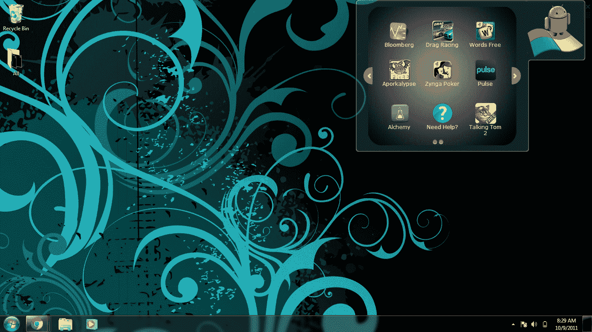

# BlueStacks 发布 App Player 和 Cloud Connect 服务，让您可以在 PC 上运行 Android 应用程序 TechCrunch

> 原文：<https://web.archive.org/web/http://techcrunch.com/2011/10/11/bluestacks-releases-app-player-and-cloud-connect-service-to-let-you-run-android-apps-on-pcs/?utm_source=dlvr.it&utm_medium=twitter>

# BlueStacks 发布了 App Player 和云连接服务，让你可以在 PC 上运行 Android 应用程序

早在 5 月份， [BlueStacks](https://web.archive.org/web/20230203200920/http://www.bluestacks.com/download.html) 从 Andreessen Horowitz、Ignition Ventures、Radar Partners、Redpoint Ventures 等公司获得了 750 万美元的首轮融资。这都是预发布。为什么要给一个还没有推出产品的初创公司这么多钱呢？因为大约[6 . 3 亿台新的 Windows 个人电脑将在今年年底发货](https://web.archive.org/web/20230203200920/http://www.gartner.com/it/page.jsp?id=1762614)，并且因为 BlueStacks 已经设计了可下载的软件，这将使 Android 应用程序能够在所有这些电脑上运行(希望如此)。

今天，为了把钱用在它的嘴上，BlueStacks 宣布发布第一批产品，这将是它正在进行的追求的一部分。首先，该公司正在为 Windows 提供其应用播放器的 [alpha 版本，这基本上是一个免费的软件下载，用户可以在任何 Windows PC、平板电脑或笔记本电脑上一键访问 Android 应用。(以及全屏查看这些应用的能力。)](https://web.archive.org/web/20230203200920/http://www.bluestacks.com/download.html)

BlueStacks 希望这对 Android(和 Windows)开发者来说是一个福音，因为该软件将使他们能够访问全球数十亿 PC 用户，而不需要他们为这些台式机、笔记本电脑和平板电脑修改应用程序。BlueStacks 团队今天还表示，PC 制造商和原始设备制造商已经表示有兴趣在他们的各种设备上开发 BlueStacks 应用程序播放器，因为它的目标是消费者和企业，从儿童教育应用程序到企业级工作流应用程序——介于两者之间的一切。

除了 app player，该公司还推出了一款名为“Cloud Connect”的产品，这是一种基于云的服务，允许 PC 成为任何基于 Android 的移动设备的真正延伸，反之亦然。基本上，在 Android Market 下载免费应用程序后，用户可以一键将 Android 设备上的应用程序与他们的 PC 同步，最多可从他们的 Android 设备移植 35 个应用程序。

该应用程序还提供了一个客户“应用程序频道”页面，用户可以在这里管理他们在云中的应用程序，查看已经下载到他们设备上的应用程序，包括“特色应用程序频道”中的条目，可以直接访问开发者提供的最新应用程序。

有了如此巨大的市场，云连接和应用播放器肯定会产生全球性的影响；BlueStacks 总裁兼首席执行官 Rosen Sharma 表示:“*Android 的开放性正在推动全球创新。我们感谢谷歌和其他人的贡献。他说:“这也是美国以及巴西、印度和中国等国家的社会均衡器，在这些国家，很大一部分只能买得起智能手机的人现在可以享受并受益于安卓平台上无处不在的应用*”。

更多信息，请点击查看 [BlueStacks 和应用播放器，或者观看下面的视频:](https://web.archive.org/web/20230203200920/http://www.bluestacks.com/download.html)