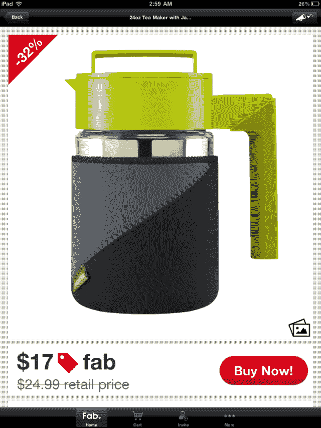
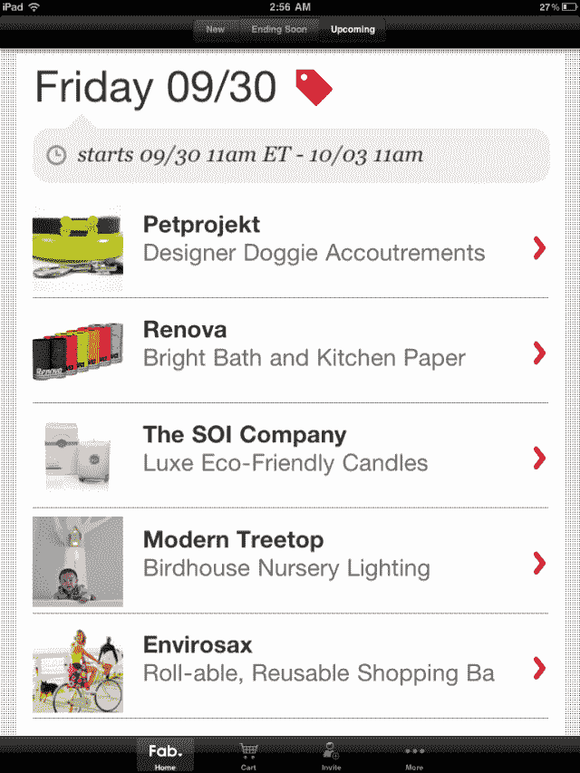
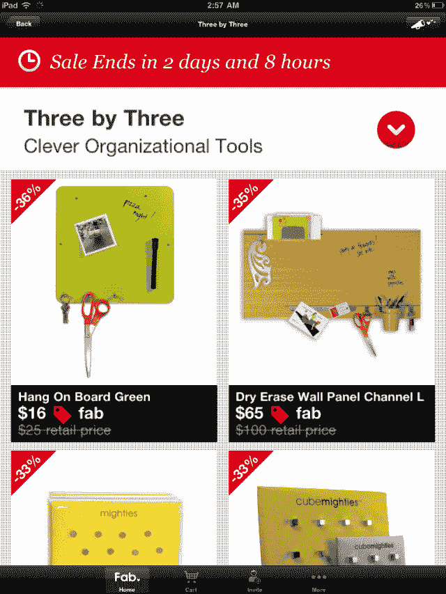

# Fab.com 发展迅猛，首次推出 Android 和 iOS 应用 TechCrunch

> 原文：<https://web.archive.org/web/http://techcrunch.com/2011/10/11/fab-com-is-growing-like-crazy-debuts-android-and-ios-apps/>

# Fab.com 正在疯狂增长，推出 Android 和 iOS 应用程序

[Fab.com](https://web.archive.org/web/20230205025704/http://fab.com/)，其前身为 [Fabulis](https://web.archive.org/web/20230205025704/http://www.crunchbase.com/company/fabulis) ，一个[同性恋社交网站](https://web.archive.org/web/20230205025704/https://techcrunch.com/2010/04/23/fabulis/)，不仅最近[更名为](https://web.archive.org/web/20230205025704/https://techcrunch.com/2010/12/13/social-network-for-gay-men-fabulis-rebrands-to-fab-com-raises-1-75-million/)，而且[也从零开始](https://web.archive.org/web/20230205025704/https://techcrunch.com/2011/06/09/scoop-fab-com-launches-online-design-store-ashton-kutcher-invests/)，开展一项全新的业务，主要围绕在线快闪销售设计项目。在 7 月份筹集了 100 万美元的种子资金和 800 万美元的首轮融资后，该公司在 pivot 之后实现了绝对惊人的增长。

这家初创公司的首席执行官杰森·戈德堡表示，该网站现在拥有超过 75 万名会员，其中仅上周末就有 4 万人注册。鉴于目前 18%的流量(和 12%的收入)来自移动设备，Fab.com 推出一些应用的时机已经成熟。

今天，该公司正在这么做，推出了安卓、iPhone 和 iPad 的应用程序。

Fab.com 每天已经创造了大约 10 万美元的销售额，戈德堡预计，在推出移动应用程序后，这个数字将迅速上升，因为这些应用程序显然是免费的。

该应用程序使用户能够在新销售上线时接收每日通知，浏览和购买商品，并在 Twitter 和脸书上分享产品，以及其他功能。

大量截图:

