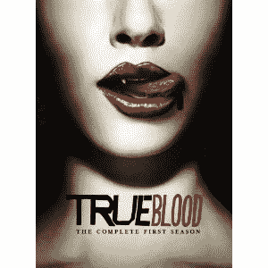

# Roku 推出 49.99 美元的 Roku LT Streamer，将 HBO GO 添加到频道产品中 TechCrunch

> 原文：<https://web.archive.org/web/http://techcrunch.com/2011/10/11/roku-introduces-the-49-99-roku-lt-streamer-adds-hbo-go-to-channel-offerings/>

# Roku 推出 49.99 美元的 Roku LT Streamer，将 HBO GO 添加到频道产品中

早在 2008 年，Roku 媒体播放器只是一种在电视上观看网飞流媒体视频的方式。几年后的今天，这项服务提供了 300 多个不同的媒体频道和一系列不同的型号，最新的型号是 Roku LT。

Roku LT 面向精打细算的消费者，售价仅为 49.99 美元。通过内置无线功能，Roku LT 可以播放 720p 的视频，并可以访问 Roku 的 300 多个频道，包括网飞、Hulu Plus、亚马逊即时视频、Pandora、EPIX、Crackle 和迪士尼。

更好的是，Roku 的服务增加了一个新的频道，我想你会喜欢的:HBO GO。不幸的是，你需要订阅 HBO GO 才能享受。但是如果你第一次没有足够的时间看《权力的游戏》的奈德·史塔克勋爵，或者你想要额外的《T2》《真爱如血》的苏琪·斯塔克豪斯，Roku LT 肯定会派上用场。其他 HBO 内容包括*木板路帝国*、*黑道家族*、*欲望都市*、*朽木*，加上 HBO 原创电影、迷你剧、体育、纪录片和特辑。

 如果你想从流媒体播放器中获得更多，比如一些游戏，Roku 仍然有你想要的。几个月前，[发布了 Roku 2 系列流媒体设备(包括 Roku 2 HD、Roku 2 XD 和 Roku 2 XS)](https://web.archive.org/web/20230203101737/https://techcrunch.com/2011/07/19/roku-launches-new-media-streamers-complete-with-motion-gaming-capabilities-perfect-for-angry-birds/) 提供基于动作的游戏，这是今年最热门的游戏之一:*愤怒的小鸟*。更多的游戏正在路上，但是当然这些东西的价格会高一些。

虽然 11 月份你可以花大约 50 美元买到 Roku LT，但 Roku 2 系列的价格将在 60 美元至 100 美元之间。在我看来，如果你能腾出额外的 10 美元，带愤怒的小鸟的 Roku 2 HD 是值得的。