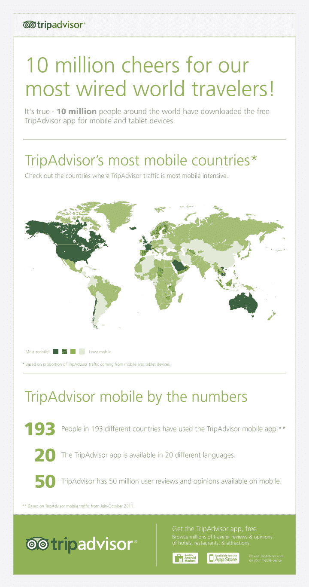

# 总移动下载量达到 1000 万后，猫途鹰在 Android TechCrunch 上推出了 20 款城市指南应用

> 原文：<https://web.archive.org/web/http://techcrunch.com/2011/10/11/tripadvisor-10-million-android-city-guide/>

# 移动下载总量达到 1000 万后，猫途鹰在安卓系统上推出了 20 款城市指南应用

说到旅游应用，拥有一个像猫途鹰这样的品牌名称会有所帮助。这家顶级旅游建议网站还拥有一些在大多数移动平台上最受欢迎的旅游应用。它的移动应用程序已经被下载了 1000 万次，其中大部分是在 iPhone 和 iPad 上(它也支持 Android、诺基亚、Windows Phone 甚至 Palm 的应用程序)。其 iPhone 应用目前是 iTunes 中排名第四的旅游应用。如果算上移动网络，移动网络用户约占其移动用户的一半，那么 TripAdvsor 每月的独立移动用户数远远超过 1000 万。

今天，TripAdviser 发布了 20 款新的 Android 城市指南[应用。这些是独立的应用程序，不需要连接到网络。它们包括地图、餐馆、酒店和景点(有评级和评论)，以及徒步旅行。该应用由 EveryTrail 团队开发，该团队于二月份通过收购](https://web.archive.org/web/20230203144549/https://market.android.com/details?id=com.tripadvisor.tripadvisor)[公司](https://web.archive.org/web/20230203144549/https://techcrunch.com/2011/02/03/tripadvisor-buys-trip-planning-service-everytrail-to-expand-mobile-offering/)而加入。

EveryTrail 专注于徒步旅行，这是这些应用程序的一大部分。它甚至包括一个指南针，为你指出下一个目的地的方向。这 20 个城市包括伦敦、巴黎、纽约、香港、罗马、旧金山和东京。

猫途鹰正处于从 Expedia 剥离的过程中。移动业务将是其未来增长的重要组成部分。

