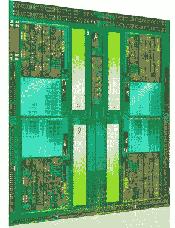

# AMD 的推土机未能达到预期 TechCrunch

> 原文：<https://web.archive.org/web/http://techcrunch.com/2011/10/12/amds-bulldozer-fails-to-meet-expectations/>

英特尔和 AMD 的战争已经持续了很长时间，我希望它能持续更长时间。然而，随着英特尔在低功耗和高性能领域的巨大增长，过去几年对失败者来说是艰难的。Core 2 Duos 表现出色，Core i*系列也是如此，其最新的消费者系列——I * s 的 Sandy Bridge 更新版——是一个庞然大物。AMD 一直落在后面，尽管从桌子的另一边你可能会说他们多年来一直在相当有效地紧咬英特尔的脚跟。

推土机应该是最终让他们加速的平台，但它已经被推迟了很长时间，现在它的推出并没有得到太多的好评。

我浏览了阿南德的全面审查，结论是它没有竞争力。 [HardOCP](https://web.archive.org/web/20230204180721/http://hardocp.com/article/2011/10/11/amd_bulldozer_fx8150_desktop_performance_review) 、 [PC Perspective、](https://web.archive.org/web/20230204180721/http://www.pcper.com/reviews/Processors/AMD-FX-8150-Processor-Review-Can-Bulldozer-Unearth-AMD-Victory) [Tom's Hardware](https://web.archive.org/web/20230204180721/http://www.tomshardware.com/reviews/fx-8150-zambezi-bulldozer-990fx,3043.html) 、 [Neoseeker](https://web.archive.org/web/20230204180721/http://www.neoseeker.com/Articles/Hardware/Reviews/amd_fx-8150/) 同意。无论是合成还是真实世界的测试，AMD 最好的 FX 处理器都没有站到英特尔的中间线，甚至没有站到他们自己去年的处理器。

是灾难吗？不完全是:我猜在某个时候，AMD 的某个人说“看，我们必须在某个时候发布一些东西。我们的客户不会永远等下去。”尽管事实上他们有许多改进在等待着(根据 AMD 分享的路线图，大概是作为一种隐蔽的道歉)，他们还是带着他们拥有的处理器进入了市场。

不幸的是，尽管采用了新的架构和疯狂的晶体管数量(8 核 8150 约有 20 亿)，但每个内核的性能和效率并不是那么好。有几个测试是关于哪个推土机能很好地处理 Sandy Bridge 的，比如那些真正针对高内核数优化的，但是在单核任务上它会被破坏。

这是有希望的:这只是新架构的第一次迭代，当 Windows 8 上市时，我们可能会看到一个新的系列和一个重大的性能提升。与此同时，虽然推土机处理器提供了不错的性能和价格，但除了它们不是英特尔之外，似乎没有人找到购买它的好理由。

如果您决定购买，请购买 8120。显然，它与 8150 是同一芯片，但测试更好的样品得到了 8150 的品牌和更高的股票时钟速度。如果你不介意自己超频，你可以用 8120 并给它一点点提升来节省 50 美元。