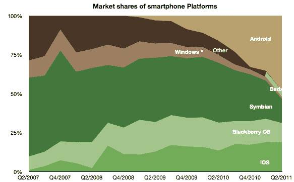

# 微软能挽回 Windows Phone 吗？TechCrunch

> 原文：<https://web.archive.org/web/https://techcrunch.com/2011/10/13/can-microsoft-salvage-windows-phone/>

# 微软能挽回 Windows Phone 吗？

当微软去年推出 Windows Phone 时，我认为这是一个永远不会开发 steam 的平台。根深蒂固的玩家——iOS、RIM 和 Android——已经控制了市场，上一款 Windows Mobile 手机和第一款 Windows Phone 手机之间的间隔太长，即使是最专注或好奇的客户也无法等待。

这似乎是异乎寻常的先见之明，因为 Gartner 和 Horace Dediu 都估计微软上个季度售出了 140 万到 170 万部 Windows Phones。正如 [Gruber 打趣的说](https://web.archive.org/web/20221127013930/http://daringfireball.net/)“换句话说，在整个季度，他们卖出的 Windows Phones 手机总量相当于苹果上周末卖出的 iPhone 4S 预订量。”

WinPho 芒果更新最近到达我们的海岸，到目前为止每个人都很高兴。奇怪的是:我认识的人和我交谈过的人都没有对 Windows Phone 特别失望，他们也没有兴趣购买。和 Palm 一样，人们普遍认为这个平台是稳固的、迷人的、美观的，但是好的手机最后才是。[就连史蒂夫·鲍尔默](https://web.archive.org/web/20221127013930/http://www.electronista.com/articles/11/09/14/microsoft.ceo.disappointed.with.year.one.wp7.sales/)也承认第一年的销量远低于预期，这并不是对该平台的一个特别令人振奋的认可。

或者我们可以跟着钱走。为了推广 Windows Phone，微软承诺向诺基亚投资 10 亿美元，其中一部分将用于销售激励。砸钱解决问题是微软的传统做法，我不怀疑这会成功。未来几年，每部手机都将是智能手机，与配备类似的 Android 和 iOS 机型相比，阻碍微软优势的唯一因素是价格。

微软还有很多工作要做。虽然我无法反驳他们在个人电脑领域的巨大领先优势，但谷歌和苹果在移动领域有着绝对的领先优势，微软很难通过收购达到顶峰。似乎旧的经营方式——补贴、捆绑销售、适度的恐吓策略和 FUD——在这种情况下对微软没有帮助。过去，你永远不会因为收购微软而被解雇。虽然我不能代表大多数 IT 部门，但情况似乎越来越不一样了。

那么 Windows Phone 何去何从？我不认为这个平台会消失，特别是随着我们可以期待的 Windows 8 和 Metro UI 的改进，以及 PC 和移动界面最终将如何融合。简单地说，我担心的是，现在取得主导地位还为时过晚，我认为这没什么。

看看这些数字和微软方面普遍的迟缓，悲观主义者可能会说这个平台已经死了。我不同意，但我认为这绝对需要给心脏注射肾上腺素。诺基亚迟迟没有将其设备推向市场，但它们将在两周后的诺基亚世界上首次亮相。如果这种合作的成果不能为 WP7 的成功提供所需的推动力，那可能什么也做不到。

[图片:[雨果](https://web.archive.org/web/20221127013930/http://www.shutterstock.com/gallery-334735p1.html) / [梭托](https://web.archive.org/web/20221127013930/http://www.shutterstock.com/)