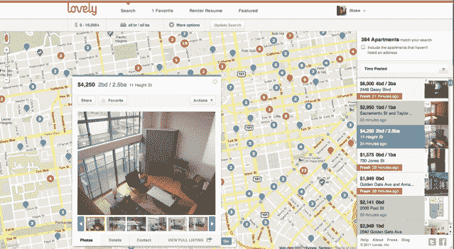

# 可爱:一个光滑的工具，让你的公寓搜索稍微不那么痛苦

> 原文：<https://web.archive.org/web/http://techcrunch.com/2011/10/13/lovely-a-sleek-tool-to-make-your-apartment-search-slightly-less-painful/>

“我在考虑搬到一个新地方”这几个字显然充满了黑魔法。说出它们，你就踏上了无数令人头疼的事情、乏味的搜索和未接电话的征途。是的，找房子很臭。

但是有一种新工具可能会让你的下一次找房子变得稍微容易一点，它不仅仅会帮你找到一套公寓——它还会帮你获得批准。遇见[可爱的](https://web.archive.org/web/20230203065501/http://www.livelovely.com/)。

这家初创公司的投资者包括 SV Angel、500 Startups、Founder Collective 和 Ben Ling，它将成为找房子的终极武器。开始很简单:前往 livelovely.com 的，你会被提示创建一个用户名和密码(或者你可以使用脸书连接)。

一旦你进去了，你会看到一张旧金山的地图，上面散布着可供选择的公寓列表(可爱公寓从湾区开始，但在未来会扩展到更多的城市)。这些数据来自 Craigslist 和 Trulia，但将来会增加更多的来源，包括直接向可爱的房东发帖。

点击一个点，你会看到一个漂亮的弹出窗口，其中包括照片，关键细节，以及可爱可以找到的任何其他相关信息。如果有许多公寓位于一个密集的区域，那么网站会将它们聚集在一个圆圈内，圆圈上有一个数字——点击这个圆圈，你会看到其余的房源。这很像使用 Padmapper，但界面更干净，更易于使用。还有一些方便的工具可以记录你喜欢的公寓，你联系过的公寓等等。

另一个非常有用的功能是:在屏幕右侧，你会看到每个列表按照新程度排序——如果添加了新的列表，列表会实时刷新。作为一个最近经历过公寓搜索的人，这是一个非常有用的功能——许多网站会让你删除几天前的房源，但这个栏让你更容易抓住弹出的最佳房源(在旧金山和纽约等城市，它们可能会在一两个小时内消失)。

除了让找房子变得更容易之外，可爱公寓还帮助确保你是真正得到房子的人。毕竟，房东通常会要求潜在租户提交他们过去的租赁历史、推荐信和其他补充材料，以确保他们能够按时支付租金。花时间收集这些信息会决定你是得到一套漂亮的公寓，还是得到一套一般的公寓。

为了帮助你做到这一点，Lovely 将为你生成一份包括这些关键信息的“租赁者简历”。这也证明了你被雇佣了，这可以进一步减轻你的顾虑。然后，当你通过 Lovely 联系经纪人或房东时，它会将这份简历附加到你的邮件中。

但对于这家初创公司来说，这一切仍为时尚早。简而言之，他们希望从根本上改变租赁市场的运作方式，为房东和租户提供工具。随着这项服务越来越受欢迎，它将在用户档案和声誉系统方面引入更多内容。他们说，目标是让这个过程尽可能透明。

但在这项任务中，他们并不孤单。竞争对手包括 Padmapper、Naked Apartments、Nestio 等。但是租赁市场是巨大的，它急需一些严重的破坏。

