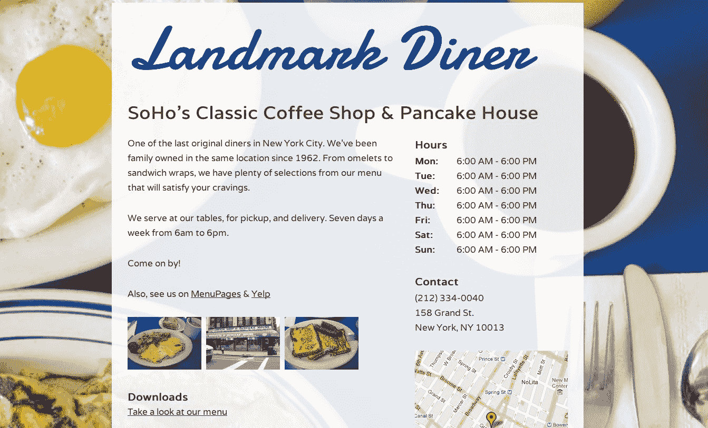

# Onepager 为一个快速、简单(且免费)的网站建设者 TechCrunch 筹集种子资金

> 原文：<https://web.archive.org/web/http://techcrunch.com/2011/10/13/onepager-raises-seed-funding-for-a-quick-easy-and-free-website-builder/>

# Onepager 为一个快速、简单(免费)的网站建设者筹集种子资金

Onepager 是一家允许任何用户或小企业主快速建立网站(免费)的初创公司，它今天宣布，它已经从纽约市的许多天使投资人那里筹集了 35 万美元的种子资金，如 Daniel Eskapa 和 Mark Birch，以继续开发新功能(即嵌入提要和视频)并支持其营销工作。

Onepager 是由马特·沙姆派恩(Matt Shampine)创建的，他也是全方位服务网站设计机构 Simande、一个介绍企业家的网站 We Are NY Tech(受到弗雷德·威尔森的[称赞)以及为创意人员、开发人员和早期初创公司提供服务的联合工作空间 WeWork Labs 的创始人。](https://web.archive.org/web/20230203133633/http://www.avc.com/a_vc/2010/12/we-are-ny-tech.html)

但是你会问，一页纸是做什么的？这个概念其实非常简单，Onepager 的设计模板使用户能够在瞬间建立自己的网站:用户只需输入他们希望出现在网站上的文本、图像、视频和链接，就像在 Word doc 中一样，然后点击发布。由于 Onepager 是 [Opensrs](https://web.archive.org/web/20230203133633/http://www.opensrs.com/) 的经销商，这家初创公司负责为其用户设置域名，用户可以从该平台搜索、购买和同步域名。该平台还提供托管服务。

Onepager 完全免费使用，或者访问者可以每月支付 8 美元购买他们自己的定制域名，并提供一整套分析工具来查看谁在点击，以及一个时事通讯生成器。

Squarespace 和 moon 水果是该领域中提供类似功能的其他初创公司，但是通过允许其用户嵌入他们的社交数据，添加连接到脸书和推特页面的按钮，添加图像，一个标志，直接从页面转发你的域名 Onepager 在手机上自动工作，因为它都与 HTML 标准兼容。(与使用闪存的月光果不同。)

Onepager 被设计成一个简单的解决方案来快速建立一个可行的网站；用户不必对超文本标记语言编码一无所知，这意味着它对当地的餐馆和小企业来说很棒，他们想建立一个网站，但又负担不起给网站设计者一大笔钱。

该网站还将很快提供 embed.ly 的嵌入服务，让网站所有者能够增强他们的多媒体产品和新闻源。所以，如果你想让你的朋友相信你是一个伟大的网页设计师，而不用去读《傻瓜的代码》，Onepager 就是你的网站。它便宜，容易，你可以在 10 分钟内建立一个伟大的网站。

[在这里查看您家中的 one pager](https://web.archive.org/web/20230203133633/http://onepagerapp.com/)，并告诉我们您的想法。