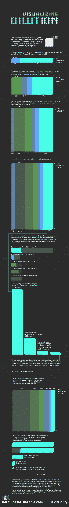

# 了解稀释如何影响你的创业 TechCrunch

> 原文：<https://web.archive.org/web/http://techcrunch.com/2011/10/13/understanding-how-dilution-affects-you-at-a-startup/?utm_source=dlvr.it&utm_medium=twitter>

# 理解稀释如何影响你的创业

***编者按:**这是 2x 创业者，现为[GRP Partners](https://web.archive.org/web/20230203160454/http://www.grppartners.com/)VC 的马克·苏斯特([@ m uster](https://web.archive.org/web/20230203160454/http://twitter.com/#!/msuster))的客座博文。在他的[创业博客](https://web.archive.org/web/20230203160454/http://www.bothsidesofthetable.com/)、* *BothSidesoftheTable 上阅读更多关于 Suster 的内容。*

众所周知，当你在一家初创公司筹集资金时，你在公司的持股比例会下降。我们的目标是让创业公司的价值上升到足够高的水平，让你在一个更大的企业中拥有更少的股份，从而提升你的个人总价值。

最简单的思考方式是:如果你拥有一家 200 万美元公司的 20%，你的股份价值 40 万美元。如果你筹集了新一轮风险资本(比如 250 万美元，投资前估值为 750 万美元，投资后估值为 1000 万美元)，你的股权会被稀释 25%(250 万英镑/1000 万英镑)。所以你拥有新公司 15%的股份，但这 15%的股份现在价值 150 万美元或收益 110 万美元。

但是理解你如何可能随着时间被稀释是一个更困难的概念。计算你在一家初创公司 5 年的股权价值更加复杂。

我不得不简化一点，但为了更容易理解，我和[visual . ly](https://web.archive.org/web/20230203160454/http://twitter.com/#!/mibi)的[杰斯·巴克曼](https://web.archive.org/web/20230203160454/http://visual.ly/about)合作。如果你想了解他们工作的力量[，看看这张史蒂夫·乔布斯的信息图](https://web.archive.org/web/20230203160454/http://visual.ly/steve-jobs-timeline)。我非常相信信息图表以及通过视觉手段对复杂主题进行更深入理解的能力。随着“大数据”变得越来越普遍，可视化的能力将变得越来越重要。

杰斯的手艺很棒。他的个人博客里有一些很棒的例子。

所以这是我们向你解释稀释世界的突破口。让我们知道你的想法。如果你想要更多这样的好处，别忘了注册我的时事通讯并在推特上关注[杰斯](https://web.archive.org/web/20230203160454/http://twitter.com/#!/mibi)。我们会再次带给你更多的美好。请告诉我们您希望我们为您细分哪些主题。

听着，理解估值的世界和股权如何在出售中分割比图表描述的要复杂得多。我希望它给你一个味道。如果你想更深入了解[，我拍摄了一些关于计算蒂姆](https://web.archive.org/web/20230203160454/http://www.bothsidesofthetable.com/2010/07/22/want-to-know-how-vcs-calculate-valuation-differently-from-founders/) e .的所有权和稀释的视频，请务必阅读 [VentureHacks](https://web.archive.org/web/20230203160454/http://www.venturehacks.com/) 。