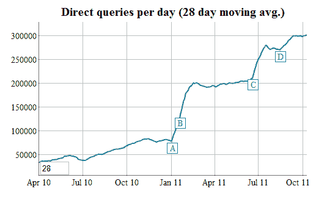

# Union Square Ventures，其他公司投资另类搜索引擎 duck duck go TechCrunch

> 原文：<https://web.archive.org/web/https://techcrunch.com/2011/10/13/union-square-ventures-invests-in-alternative-search-engine-duckduckgo/>

# 联合广场风险投资，其他人投资替代搜索引擎 DuckDuckGo

在一篇[博客文章](https://web.archive.org/web/20230203080129/http://www.usv.com/2011/10/duck-duck-go.php) , [联合广场风险投资](https://web.archive.org/web/20230203080129/http://www.crunchbase.com/financial-organization/union-square-ventures)，[布拉德·伯纳姆](https://web.archive.org/web/20230203080129/http://www.crunchbase.com/person/brad-burnham)刚刚宣布公司已经投资 [DuckDuckGo](https://web.archive.org/web/20230203080129/http://www.crunchbase.com/company/duck-duck-go) ，一家初创公司正在建立一个漂亮的[搜索引擎](https://web.archive.org/web/20230203080129/http://duckduckgo.com/)，减少了[混乱，增加了](https://web.archive.org/web/20230203080129/https://techcrunch.com/2011/06/20/duckduckgo-to-google-bing-users-escape-them-filter-bubbles/)隐私。

斯科特·班尼斯特、吉姆·杨、杰夫·米勒、约书亚·沙赫特、卡尔·维普里、约书亚·斯泰尔曼和彼得·赫什伯格也投资了这轮投资，[创始人兼首席执行官](Gabriel%20Weinberg)[加布里埃尔·温伯格](https://web.archive.org/web/20230203080129/http://www.crunchbase.com/person/gabriel-weinberg)写道。

USV 管理合伙人伯纳姆将加入这家羽翼未丰的公司的董事会。他写道:

> 这家公司很年轻，人手不足，所以加布里埃尔希望填补一些空白，但他的观察[“传统算法信号不是网络上的唯一权威”，](https://web.archive.org/web/20230203080129/http://www.gabrielweinberg.com/blog/2011/04/are-you-chasing-a-fad-or-a-market.html)以及他巧妙利用真正的权威来管理搜索结果，使 Duck Duck Go 成为你日常品牌的一个有趣的替代选择。

目前还不清楚 USV 在该公司投资了多少，但我们正在挖掘更多信息。

来自温伯格关于筹款的博客文章:

> 我最初的计划是推迟融资，直到我找到一个令人信服的理由，或许是永远推迟。不管是好是坏，我坚持了那个计划，这个计划最终被推迟了 3.5 年。
> 
> 为什么是现在？去年年底，我注意到搜索引擎开始以一种前所未有的方式赢得更多人的点击。不要误会我的意思，我们还有很长的路要走才能实现我们的愿景，但很明显，有些东西真的开始变得引人注目，例如我们的零点击信息、隐私政策和好吃的东西。

根据 DuckDuckGo 的[内部统计数据](https://web.archive.org/web/20230203080129/http://duckduckgo.com/traffic.html)，这是它的成长过程。

