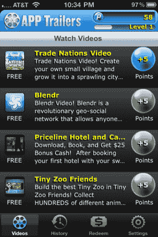

# 应用预告片为您提供观看应用视频的礼品卡技术危机

> 原文：<https://web.archive.org/web/http://techcrunch.com/2011/10/14/app-trailers-gives-you-gift-cards-for-watching-app-videos/>

# 应用预告片为您提供观看应用视频的礼品卡

移动广告初创公司[appre credit](https://web.archive.org/web/20230205040320/http://www.appredeem.com/)刚刚推出了应用预告片，这是一款奖励观看移动应用视频的人的新产品。该服务[可从 iTunes App Store](https://web.archive.org/web/20230205040320/http://itunes.apple.com/us/app/app-trailers/id469489347?ls=1&mt=8) 获得，它使用的模式不同于当今典型的激励安装程序。相反，用户在观看预告片时会得到积分，然后可以在视频结束时下载应用程序。只有当用户点击“是”时，广告商才会被收费。

阿普雷登说，这些类型的安装对广告商来说更有价值，因为用户表示他们实际上想安装并试用该应用程序。无论用户选择安装与否，他们得到的点数都相同，所以他们实际上只下载他们感兴趣的应用程序——点击“是”没有好处。

应用程序中列出的每个视频值 10 分，但用户注册他们的电子邮件或邀请朋友尝试该服务可获得 25 分。

奖励包括 1 美元的亚马逊礼品卡(100 分)、5 美元的 REI 礼品卡(500 分)、10 美元的板条箱和桶、Fandango 或 Macy 礼品卡(1000 分)和 25 美元的耐克、诺德斯特龙或陶制谷仓礼品卡(2500 分)。

考虑到您需要多长时间积累足够的积分来获得顶级奖励，很明显，这个应用程序最适合那些有大量空闲时间的人。(也许是那些没有“愤怒的小鸟”瘾的人？)

也就是说，在日益拥挤的应用市场中，应用预告片无疑是推动应用安装的一种独特方式。谁知道呢？当服务增加一点时，你甚至可能会发现一个新的应用程序来尝试。目前，有许多热门应用程序的视频，包括 Priceline、Groupon、LivingSocial、SkyGrid、PingMe、Blendr 等。唯一的问题？显然，你不会因为手机上已经安装了所有这些应用程序而获得任何积分。真扫兴。

你可以从[这里](https://web.archive.org/web/20230205040320/http://itunes.apple.com/us/app/app-trailers/id469489347?ls=1&mt=8)自己尝试 App 预告片。

AppReedem [在 6 月份从 SV 天使和 Blue Run Ventures 筹集了 70 万美元](https://web.archive.org/web/20230205040320/https://techcrunch.com/2011/09/01/appredeem-launches-in-app-deals-to-drive-users-of-free-apps-to-their-paid-versions/)。它在安卓[上也有一个苹果品牌的应用。](https://web.archive.org/web/20230205040320/https://market.android.com/details?id=com.appredeem)