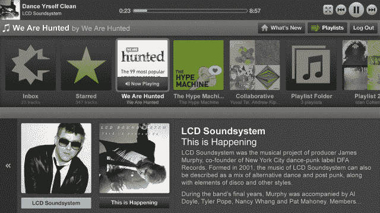

# 终于:Spotify 应用程序可以在 Boxee TechCrunch 上使用了

> 原文：<https://web.archive.org/web/http://techcrunch.com/2011/10/14/at-long-last-spotify-app-now-available-on-boxee/>

# 终于:Spotify 应用程序可以在 Boxee 上使用了

同样向 T2 Spotify T3 用户付费的 Boxee Box T1 的所有者应该感到高兴，因为这两个软件已经被 T4 T5 整合成一个甜美的音乐流媒体应用 T7。

拥有 Spotify Premium 订户(每月 9.99 美元)的 Boxee 用户现在可以直接在电视上点播 Spotify 的数百万首歌曲。

就在上周，Spotify [宣布](https://web.archive.org/web/20230203155124/http://musically.com/blog/2011/10/07/spotify-gets-to-us-televisions-with-wd-tv-deal/)与 [Western Digital](https://web.archive.org/web/20230203155124/https://techcrunch.com/2011/10/06/wd-tv-live-media-streamer-skips-internal-storage-for-spotify/) 达成协议，进军美国电视屏幕，与 [Boxee](https://web.archive.org/web/20230203155124/http://www.crunchbase.com/company/boxee) 的合作表明，该公司正进一步加大努力，将电视作为其第三块屏幕。

好家伙，这个 Boxee 交易已经等了很久了。

我怀疑这与 Spotify 之前在美国不可用有关(他们终于在 2011 年 7 月 14 日登陆美国)。据路透社报道，美国已经有 25 万用户为这项服务付费。

Boxee 上的其他音乐流媒体应用包括 [Grooveshark](https://web.archive.org/web/20230203155124/http://blog.boxee.tv/2011/08/11/grooveshark-lurking-in-the-water-on-boxee/) 和 [MOG](https://web.archive.org/web/20230203155124/http://blog.boxee.tv/2011/08/30/stream-music-in-top-quality-hd-with-mog-on-boxee/) 。接下来， [Rdio](https://web.archive.org/web/20230203155124/http://rdio.com/) ？

