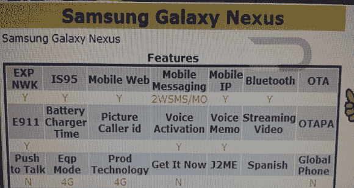

# Galaxy Nexus 出现在威瑞森的设备管理系统 TechCrunch 中

> 原文：<https://web.archive.org/web/http://techcrunch.com/2011/10/14/the-galaxy-nexus-pops-up-in-verizons-device-management-system/?utm_source=dlvr.it&utm_medium=twitter>

# Galaxy Nexus 出现在威瑞森的设备管理系统中

如果属实，一份来自威瑞森设备管理系统的新泄露文件证实了早前的传言，即下一款官方谷歌手机确实将被称为 Galaxy Nexus。冰淇淋三明治的发布会已经定于 10 月 19 日，届时三星和谷歌预计将发布下一代 Nexus。

最初由 [Droid-Life](https://web.archive.org/web/20230203143439/http://www.droid-life.com/2011/10/13/samsung-galaxy-nexus-pops-up-in-verizon-system-name-and-4g-lte-essentially-confirmed/) 发现的泄露文件显示，Galaxy Nexus 将在威瑞森的 4G LTE 网络上运行，但看起来新手机不会是全球手机。[早期的规格泄露](https://web.archive.org/web/20230203143439/https://techcrunch.com/2011/10/06/nexus-prime-details-leaked-new-name-verizon-exclusive/)描述了一个巨大的 4.65 英寸显示屏，1.2GHz TI OMAP 4460 处理器，500 万像素摄像头，1GB 内存，32GB 内部存储，NFC 芯片，当然，还有 Android 冰淇淋三明治。

根据威瑞森通常的定价方案，我们可以预计这款 LTE 设备的合约价格约为 299 美元。但是在得到官方消息之前我们什么都不知道。

