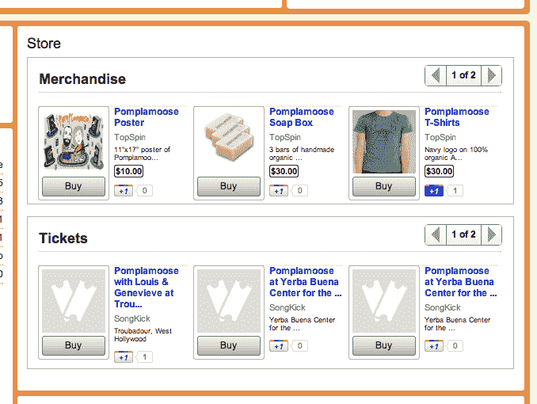

# YouTube 现在允许音乐合作伙伴销售商品、数字下载和活动门票 TechCrunch

> 原文：<https://web.archive.org/web/http://techcrunch.com/2011/10/16/youtube-now-allows-music-partners-to-sell-merchandise-digital-downloads-and-event-tickets/>

# YouTube 现在允许音乐合作伙伴销售商品、数字下载和活动门票

谷歌在上周的第三季度收益报告中透露，我们已经知道 YouTube 每天有 30 亿视频被观看，但现在这个在线视频巨头每月有 8 亿人访问该网站。今天，YouTube 也[宣布](https://web.archive.org/web/20230205042428/http://youtube-global.blogspot.com/2011/10/new-youtube-features-for-music-artists.html)可以通过该网站销售商品、门票等。

通过名为 Merch Store 的功能，YouTube 合作伙伴将能够向粉丝和访客出售艺术家商品、数字下载、音乐会门票和其他体验。YouTube 已经与许多公司合作推出了这些商店。上旋球有助于商品销售、音乐会门票和体验；SongKick 将帮助销售音乐会门票；iTunes 和亚马逊将推动音乐下载交易。

YouTube 表示，将在未来几周向全球音乐合作伙伴推出 Merch 商店。YouTube 拒绝透露这些销售的财务分成的具体性质，但表示该网站仅从销售额中抽取一小部分来弥补成本。然而，无论是通过 Merch 商店还是通过其他渠道的代销商，艺术家都能获得相同的收入。

向艺术家 YouTube 网站添加商品销售、门票销售、数字下载等功能，无疑让这些网站对艺术家及其粉丝更具吸引力。这些目的地现在将不仅仅是发现音乐视频的一种方式，也是交易业务和实际看到艺术家并购买他们作品的一种方式。

