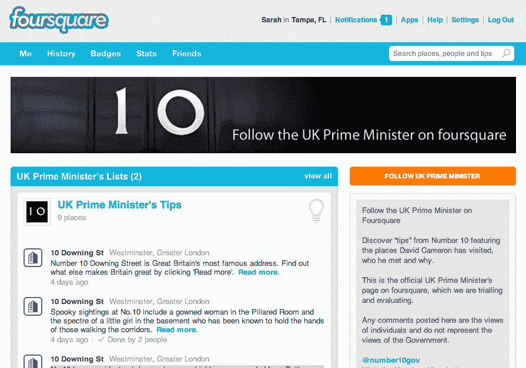

# 英国首相大卫·卡梅伦加入 Foursquare 和 LinkedIn TechCrunch

> 原文：<https://web.archive.org/web/http://techcrunch.com/2011/10/17/u-k-pm-david-cameron-joins-foursquare-and-linkedin/>

英国首相大卫·卡梅伦最近加入了社交网站 LinkedIn 和 Foursquare，以扩大他的数字存在，并更好地与公民和企业建立联系。根据首相办公室的官方博客文章，卡梅伦将在 LinkedIn 上与“首相会见的关于英国商业、企业和制造业的人和企业”建立联系。

与此同时，在 Foursquare 上，首相将在各种场所签到，以便“展示首相在唐宁街以外的日常职责中参加的活动。”

卡梅隆，[最近因其为英国互联网服务提供商创造了一种新的“色情过滤器”而成为新闻人物](https://web.archive.org/web/20230205021731/http://www.techmeme.com/111011/p17#a111011p17)，他已经活跃在社交网络上，包括[脸书](https://web.archive.org/web/20230205021731/http://www.facebook.com/DavidCameron)、 [Flickr](https://web.archive.org/web/20230205021731/http://www.flickr.com/photos/number10gov) 、 [Twitter](https://web.archive.org/web/20230205021731/http://www.twitter.com/number10gov) ，甚至新人 [Google+](https://web.archive.org/web/20230205021731/https://plus.google.com/u/0/101752040505756228125/posts?hl=en) 。将 Foursquare 和 LinkedIn 添加到列表中凸显了这些服务在当今数字世界中日益增长的重要性。

也就是说，LinkedIn 的努力有点奇怪，因为大多数人使用这项服务来维护他们的在线简历，并通过他们的业务关系寻找工作机会。它通常不被认为是政治家的交流平台。然而，看看首相加入后会发生什么应该是很有趣的。其他政客会想这么做吗？或者他们会坚持更多的社交网站，如脸书和推特？

无论如何，看到像卡梅伦这样才华横溢的人在 LinkedIn 上的个人资料，确实让这个人更人性化了一步。和其他许多才华横溢的政治家一样，他经常被认为是一个抽象的人物，而不是一个真实的人。读一读他的简历令人耳目一新，他的简历开头简单地写道“我在 2010 年 5 月大选后成为首相”，好像他只是一个谈论他的职业的普通人。(当你发现你和他是三级关系时，这也很有趣！)

首相的 four square 账户通过追踪卡梅伦会见了谁，何时以及为什么会见，提供了一个多少有点窥淫癖的政客的所作所为。在过去的几个星期里，在官方公告发布之前，首相已经在包括纽约、安大略、下议院等地进行了检查。然而，如果首相坚持检查实际的场馆，而不是像“渥太华”这样的城市大小的场馆，那将会更有帮助(这不是你应该做的，先生。)

【T2

此外，Foursquare 帐户还向其追随者提供“提示”(在他们入住唐宁街 10 号等特定场馆时出现)，提供关于该场馆的一些琐事或历史，如历史事实、鬼故事和网络上相关资源的链接。例如，你知道[10 号有一只名叫拉里](https://web.archive.org/web/20230205021731/https://foursquare.com/number10gov)的常驻猫负责害虫控制吗？多亏了 Foursquare，我现在知道了。哦，如果你感兴趣，你也可以在 Flickr[Flickr](https://web.archive.org/web/20230205021731/http://www.flickr.com/photos/number10gov/6240902740/in/photostream)上看到拉里挂在橱柜周围的照片。