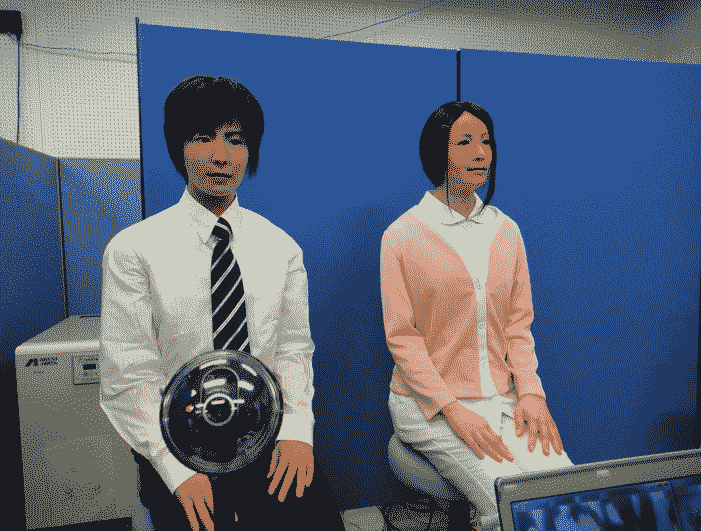

# Actroid-F:日本的超逼真人形机器人有了一个兄弟(视频)

> 原文：<https://web.archive.org/web/http://techcrunch.com/2011/10/18/actroid-f-japans-super-realistic-humanoid-gets-a-brother-video/?utm_source=twitterfeed&utm_medium=twitter>

# Actroid-F:日本超逼真人形得到一个兄弟(视频)

你还记得 Actroid-F 吗，我们去年给你看过的超逼真人形机器人[？她的制造商，机器人公司](https://web.archive.org/web/20230204151912/https://techcrunch.com/2010/10/27/videos-super-realistic-female-humanoid-actroid-f/) [Kokoro](https://web.archive.org/web/20230204151912/http://www.kokoro-dreams.co.jp/english/index.html) 和日本[国家高级工业科学技术研究院](https://web.archive.org/web/20230204151912/http://www.aist.go.jp/index_en.html) (AIST)，显然从那时起就一直在努力为她创造一个“兄弟”。

根据 AIST 的说法，人们一直在问研究所为什么只制造了一个女性机器人，他们不仅这样做了，还在新机器人的眼睛里植入了摄像头，让他在交流时看着人(或其他机器人)。

下面是一段男性人形与妹子互动的视频(英文，由 [Diginfo TV](https://web.archive.org/web/20230204151912/http://www.diginfo.tv/2011/10/18/11-0227-r-en.php) 拍摄):
【YouTube = http://www . YouTube . com/watch？v = df 39 ygp 53 MQ&w = 560&h = 315】