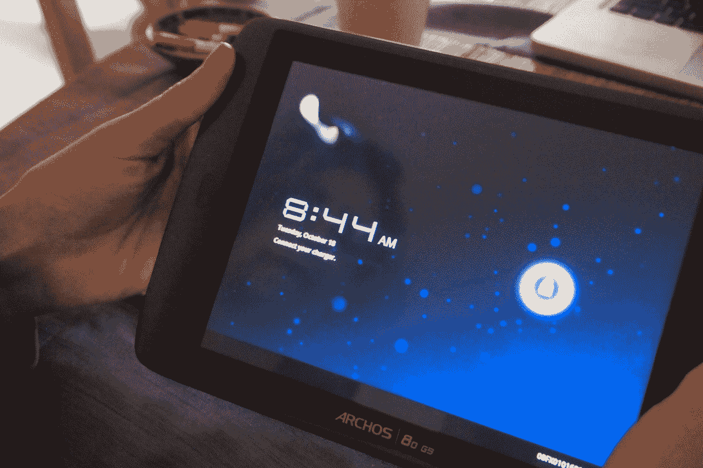
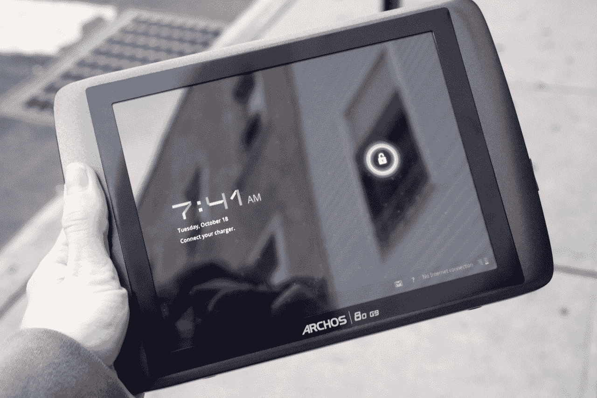
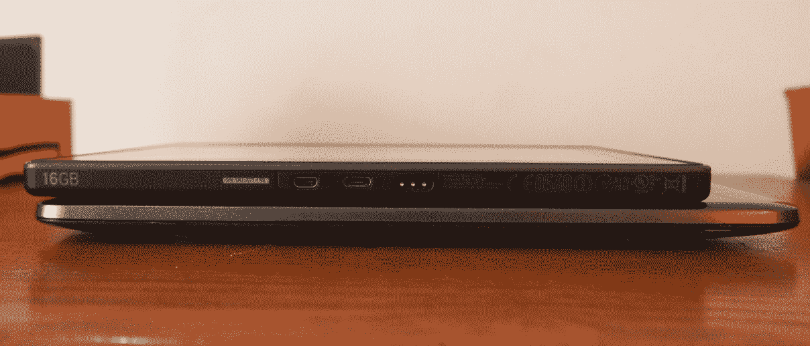

# 爱可视 80 G9 平板电脑评论:有趣但丑陋 TechCrunch

> 原文：<https://web.archive.org/web/https://techcrunch.com/2011/10/18/archos-80-g9-tablet-review-fun-but-ugly/>

**简而言之:**爱可视 80 G9 平板电脑不一定是我向平板电脑发烧友推荐的东西，但它肯定能完成任务。由纯 Android 3.2 蜂巢驱动，该标签提供了你所期望的 Android 的一切和各种各样的端口，尽管有点粗糙。

**特色:**

*   8 英寸 1024×768 电容式触摸屏
*   8GB、16GB 和 250GB(硬盘)存储选项
*   安卓 3.2 蜂巢
*   1GHz 双核处理器
*   用于 720p 视频聊天的前置网络摄像头

**优点:**

*   股票 Android 安装工作正常
*   电池寿命超过了广告宣传的数量，这是前所未闻的/可爱的
*   通过 HDMI-out 观看高清 1080p 视频是一种意想不到的享受

**缺点:**

*   非常差的构建质量
*   说得好听点，这不是我见过的最华丽的平板电脑
*   只有 Wi-Fi，但它用一个只能在欧洲使用的 3G 加密狗插槽来戏弄你

**长版:**

**正文**

虽然它不完全符合我的口味，但我不会说爱可视 G9 很丑。石板偏离了你更简约的设计，比如 iPad 和 Galaxy Tab，而是增加了一点亮色。G9 采用深灰色边框，以及带有圆形边缘的浅灰色塑料外壳。在侧面，你会发现一个用于充电的 microUSB 端口，HDMI 输出和锁定按钮。还有一个全尺寸的 USB 端口，用于支持 3G 加密狗，但不幸的是，这只能在欧洲使用。对于我们这些在美国的人来说，它只是一个全尺寸的 USB 插槽。

爱可视 80 G9 平板电脑的构造可能是我最不满的地方。诚然，它带有一个完全坚固的小支架，这是一个有用的补充，但总的来说，你可以告诉它不是一个高质量的构建。如果你轻轻按压光滑的塑料背板，无论是 3G USB 端口还是支架区域，塑料都会凹陷并发出一点破裂的声音。更糟糕的是，塑料凹陷足以影响显示屏，让它看起来像你在触摸屏上按得太用力了。

尺寸方面，G9 刚刚好。我玩过很多 10 英寸和 7 英寸的平板电脑，但 8 英寸的平板电脑似乎没有什么变化。我发现它对于游戏来说是一个很大的尺寸，因为你不会为了更好的握持而牺牲太多的屏幕空间。

**处理器/电池**

这个小家伙的处理能力让我印象深刻。Android 3.2 Honeycomb 在 G9 的双核 OMAP 4 SoC 芯片的支持下运行起来像做梦一样。即使有一点压力测试——我尽可能快地在界面/网页上滑动手指——标签也能轻松跟上。然而，一旦我同时运行几件事情(几个应用程序、一部电影和浏览器)，处理器肯定会失去速度。当我试图在列表中添加更多任务时，我开始感觉到滞后，我启动的下一个应用突然崩溃了。

另一方面，电池寿命是一个惊喜。爱可视承诺 7 小时的视频播放，G9 出色地完成了这一承诺。上周，我花了一整天的时间在 G9 上工作，尽管这不是我工作过的最有效率的一天，但 G9 还是伴随了我一整天。然而，值得注意的是，随着电池寿命的减少，平板电脑的速度越来越慢。充满电后，按下锁定按钮几乎可以立即唤醒 G9。一旦电池寿命变低，需要几秒钟才能醒来并感知手势。

**显示**

G9 上的 1024×768 LCD 显示屏比预期的要好，像素之间的差异非常小。这在看高清电影时变得最为明显，我看了很多。更好的是，这是一种很多人都可以享受一下子观看内容的平板电脑。即使与侧面成 45 度角，屏幕仍能显示出色的质量和色彩。多亏了支架，我猜你可以让五六个人同时看一部电影。然而，从更低或更高的角度看屏幕变得越来越困难。

把它带到户外不一定是理想的，但随着屏幕亮度的提高，我仍然可以把它作为一个电子阅读器来使用。不过，观看视频和图片更加困难。

**声音**

另一方面，音频可能会让你和你的朋友难以欣赏电影。在我开空调之前，我和室友们正舒舒服服地看着几个音乐视频。开了空调后，我们不得不把音量开到最大才听得见。同样，音频听起来有点模糊，尤其是当被推到最大时。就平板电脑而言，音频质量是足够的，但没有什么值得兴奋的。

**摄像头**

不幸的是，G9 的前置网络摄像头使用起来并不那么愉快。一开始根本不行，直到我下载了一个固件更新。自从它工作以来，但一直超级错误。有时，取景器会变黑。如果你碰巧在“黑色时期”拍了一张照片，这张照片也是一个黑色的大矩形。当它工作时，不出所料会有颗粒感，但至少在它重要的地方完成了工作:视频聊天。

**结论**

售价不到 300 美元的爱可视 G9 是一块不错的石板。它配备了所有的必需品，电池寿命应该和你一样长。但如果你正在寻找一款高质量的平板电脑，这可能不是它。我会推荐它作为给青少年的圣诞礼物，或者给年长一些的人(他们做的大多是简单的任务，比如浏览网页和回复电子邮件)的移动计算设备。就尺寸而言，它非常适合喜欢游戏的人，而且它肯定足够轻，可以随身携带。

【T2

这不是一款科技极客的平板电脑，如果你期待它的高质量，你会非常失望。

配置选项:

*   爱可视 80 G9 8GB:299.99 美元
*   爱可视 80 G9 16GB Turbo(处理器提升至 1.2 GHz):319.99 美元
*   爱可视 80g 9 250 GB Turbo:369.99 美元
*   爱可视 101 G9 8GB:369.99 美元
*   爱可视 101 G9 16GB Turbo:399.99 美元
*   爱可视 101 G9 250 GB Turbo:449.99 美元