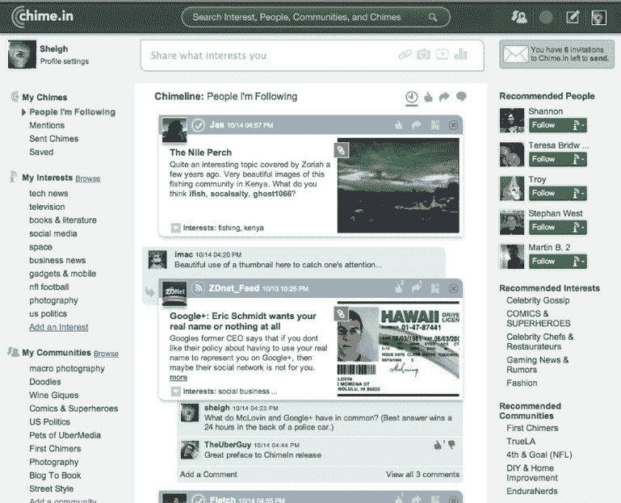

# Bill Gross 解释了 Chime 的不同之处。in:“你可以跟随一个人的某个部分”

> 原文：<https://web.archive.org/web/http://techcrunch.com/2011/10/18/gross-chime-in-follow-part-person/>

# 比尔·格罗斯解释了谐音的不同之处:“你可以跟随一个人的一部分”

比尔·格罗斯刚刚上台正式介绍 UberMedia 的最新产品 [Chime.in](https://web.archive.org/web/20230203065953/http://chime.in/) 。应用程序[昨天登陆 iTunes](https://web.archive.org/web/20230203065953/https://techcrunch.com/2011/10/17/ubermedia-quietly-inadvertently-releases-chime-in-a-mobile-social-networking-app/)。它是一个围绕兴趣建立的在线移动社交网络。

我们最近已经看到许多公司试图解决兴趣图问题，Chime.in 是最新的一家。Chime.in 通过将兴趣图放在社交图(你认识的人之间的联系)之上来做到这一点。实现这一点的一个方法是应用一个更好的“选择性跟随”模型。“你可以跟踪一个人的一部分或整个人，”格罗斯解释道。因此，如果你只关心我对技术和创业公司的看法，而不关心我发布的照片，你只能关注我的创业流。

通过这种方式，Chime.in 试图从你最吵闹的朋友那里过滤掉很多噪音(你好，Scoble)。在后台，格罗斯还向我解释了 Chime.in 和谷歌圈子(可以让你对你的朋友和你关注的人进行细分)之间的区别。“Google Circles 过滤的是出站，”格罗斯说，“这是入站过滤。”他的意思是，附和/加入不仅仅是通过朋友来过滤，而是通过他们发布和分享的话题来过滤。

Chime.in 旨在让人们可以分享他们的想法、照片、视频和链接。这也可能成为娱乐品牌的营销渠道。格罗斯宣布与 E！娱乐、环球影业、Bravo 电视和迪士尼，以及康卡斯特的投资(UberMedia)。

这就是 Chime'in 的收入模式发挥作用的地方。品牌可以在他们的 Chime.in 页面和手机应用程序中投放广告。这些就像脸书的粉丝页面，除了品牌本身可以从页面上的广告中赚钱。“我们让任何品牌制作任何丰富的个人资料页面，我们给他们毗邻的房地产。他们希望在社交活动发生的地方。”除了简单地将链接返回到他们自己的网站，品牌还可以将他们的社交流货币化。

