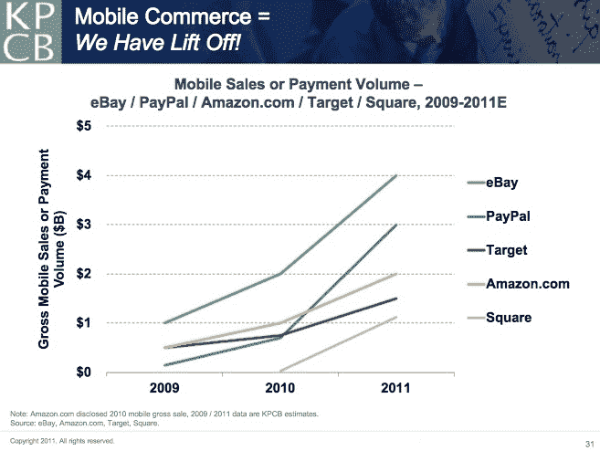
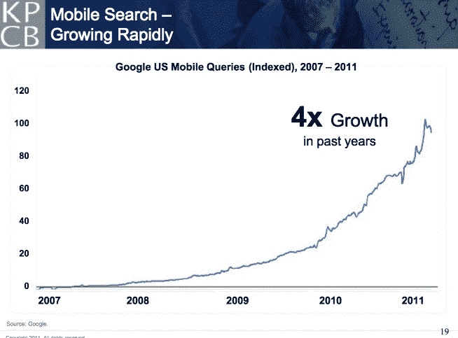
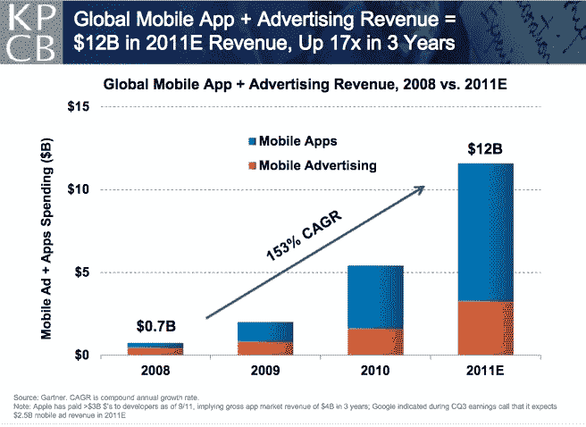
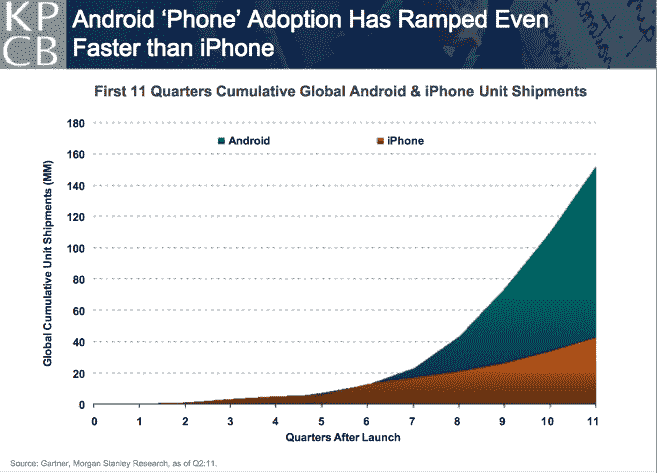

# 米克说，潘多拉和 Twitter 的大部分流量是移动的；Square 交易增长 20，000% TechCrunch

> 原文：<https://web.archive.org/web/http://techcrunch.com/2011/10/18/meeker-mobile-pandora-twitter-square/>

# 米克说，潘多拉和 Twitter 的大部分流量是移动的；广场交易增长了 20，000%

今天，玛丽·米克尔在 Web 2.0 峰会上做了她的年度幻灯片演示。对我来说，最突出的幻灯片是那些跟踪移动网络突破性增长的幻灯片，这是她去年[关注的趋势](https://web.archive.org/web/20230203082753/https://techcrunch.com/2010/11/16/meeker-smartphones-pcs/)，并且继续[密切跟踪的趋势](https://web.archive.org/web/20230203082753/https://techcrunch.com/2011/02/10/meeker-mobile-slides/)。移动电话一直在加速增长。我拿出了她的五张幻灯片来说明这一趋势。

对于某些大型互联网服务来说，手机已经占据了大部分流量。对于 Pandora 来说，65%的流量来自移动端，而 Twitter 则有 55%来自移动端。与此同时，脸书只有 33%的手机用户(这一比例预计将大幅增加)。

移动销售也正在成为电子商务的重要驱动力。易贝的总移动销售额已经达到 40 亿美元，贝宝的移动交易额达到 30 亿美元，亚马逊估计达到 20 亿美元，Square 的系统总移动销售额已经达到 10 亿美元(令人难以置信的 20，000%的年增长率)。

移动搜索在过去一年增长了四倍，而移动应用和广告收入自 2008 年以来的复合年增长率为 153%。在过去的四年里，移动应用和广告已经从 7 亿美元的市场发展到今年估计 120 亿美元的市场。

当然，这种增长很大程度上是由两个移动平台推动的，iPhone 和 Android。这真的是两匹马的比赛。然而，在平板电脑方面，两匹马的竞赛在 iPad 和 Kindle 之间展开。

