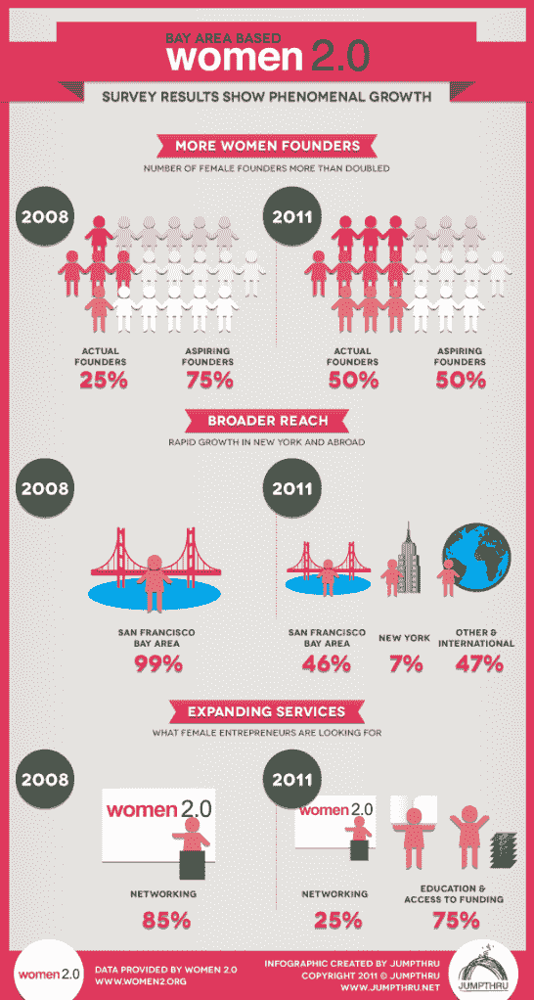

# 女性 2.0:女性创始人的数量在过去三年翻了一番 TechCrunch

> 原文：<https://web.archive.org/web/http://techcrunch.com/2011/10/18/women-2-0-number-of-women-founders-doubled-over-past-three-years/>

# 女性 2.0:女性创始人的数量在过去三年翻了一番

一个旨在增加科技创业公司女性创始人数量的组织 Women 2.0 今天分享了一些好消息:在过去三年中，女性创业公司的数量翻了一番。新数据来自对其自身社区的调查，其中包括从实际创始人和联合创始人到有抱负的企业家在内的所有人。

早在 2008 年，Women 2.0 进行了同样的受众调查，发现其社区中有 25%是女性创始人。今天，超过 50%的观众可以这么说。

当然，仅仅对一个以女性为中心的技术社区的受众进行民意调查不会给你提供与你从整个创业社区中广泛取样并寻找随时间变化时相同的硬数据。然而，这可能确实表明，2008 年那些声称“正在考虑创业”的受访者中，有许多人实际上坚持到底，创办了自己的公司。这本身就应该成为女企业家的坚实动力。

从之前的调查到今天的另一个变化是女性 2.0 受众的位置。2008 年，近 100%的社区位于旧金山湾区。现在，湾区占 46%，纽约占 7%，其余成员(其中包括国际成员)占观众的 47%。

《女性 2.0》称，随着受众的成熟，它已经成长了多年。三年前，85%的社区只对事件感兴趣。现在，25%的人对活动感兴趣，其余的人对创业教育和获得资金感兴趣。

该组织还宣布，考夫曼基金会正在为妇女 2.0 提供第二轮企业赞助..企业赞助将帮助 Women 2.0 通过其在线网站和[其全球网络活动(如创始人星期五](https://web.archive.org/web/20230203204446/http://www.women2.org/founder-friday-networking-mixers-november-2011/))扩展其教育资源。

*更正:最初，Women 2.0 写信给我们说，退出或获得资助的妇女人数没有显著变化，但是他们后来报告说，他们实际上没有就这个问题进行民意调查。为此，我们从报告中删除了对这一特定结果的提及。*

