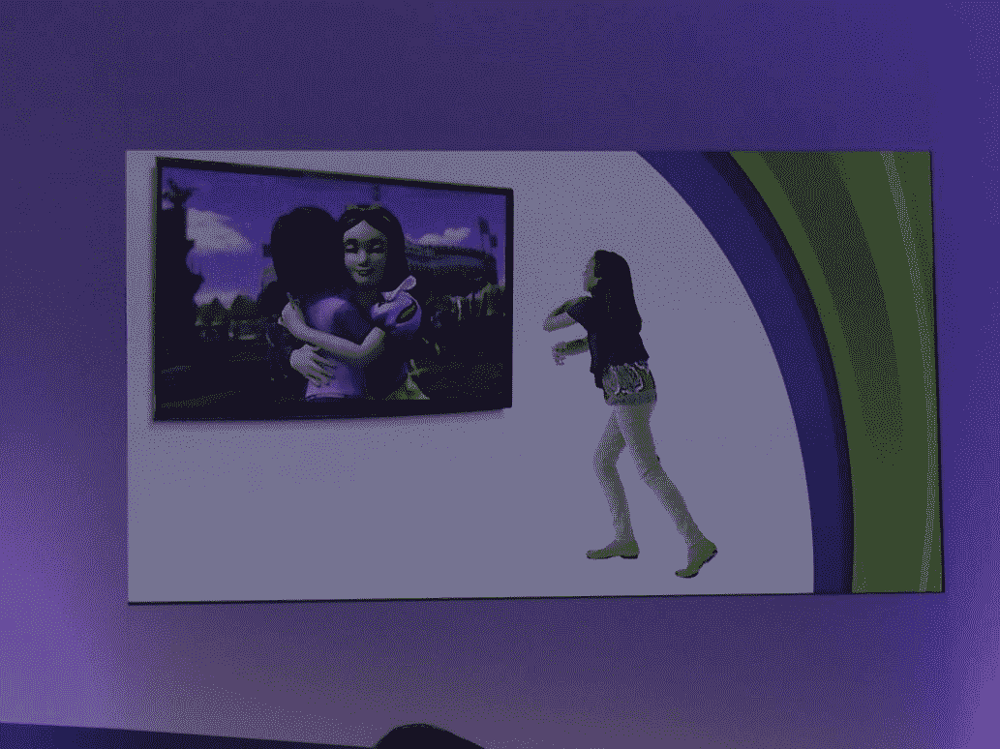
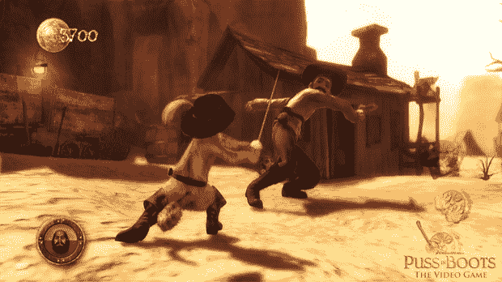
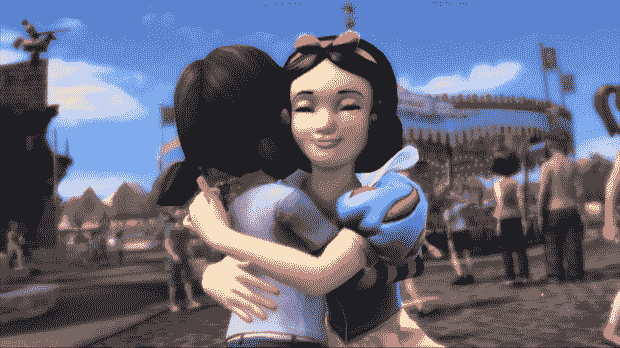

# 儿童视角的微软儿童版 Kinect TechCrunch

> 原文：<https://web.archive.org/web/http://techcrunch.com/2011/10/19/a-childs-eye-view-of-microsofts-kinect-for-kids/>

昨天，我带着我六岁的儿子 Kasper 去参加了微软的儿童 Kinect 活动，希望能更好地了解微软为抓住年轻群体所做的努力。虽然他已经是一个狂热的周末游戏玩家，但我想知道微软最新的沉浸式游戏解决方案是否会让他产生兴趣。我发现了两件事:Kinect for Kids 计划，正如上图所示，是一个有时令人悲伤但令人身临其境的 [Kinect](https://web.archive.org/web/20230203132444/https://techcrunch.com/tag/kinect/) 游戏空间，微软发布大部分游戏的年龄窗口非常窄。

首先，好东西。我很高兴地报告，Kinect 版本的*穿靴子的猫*是这一季的赢家，它的主角允许一些有趣的、身临其境的游戏。你是猫(靴子的他)，史莱克的名声，你配备了一把剑，一顶帽子，和一双西班牙皮革 botas。你在游戏中砍、踢、打，偶尔在穿过遥远的贫民窟时从一根绳子跳到另一根绳子。这是我们看到的更具沉浸感的冒险游戏之一，卡斯帕非常喜欢。紧随其后的是 *Kinect 星球大战*，尽管互动和游戏性对我来说还是太不稳定了。屏幕上的绝地连枷四处乱转，感觉更像是一个轨道射手。

另一个赢家是 *Kinect 体育 2* 。这增加了滑雪和网球，它和原始运动一样有效，也就是说，人造运动足够逼真，可以模拟真实的运动。

然后我们退化到互动的“小孩子”游戏、*从前是个怪物*，互动的芝麻街和国家地理“秀”，以及*迪斯尼乐园冒险*。这些游戏依次模拟了怪物、芝麻街和迪斯尼乐园。例如，在*从前的怪物*中，你变成 Elmo 或饼干怪物，在树林中跑来跑去，在东西上保持平衡。在迪士尼乐园历险记中，你去迪士尼乐园。在国家地理互动电视节目中，你假装成一只吃飞蛾的熊。这是微软的支票簿开发放大。通过这些品牌批发支付父母的心、思想和信任，他们不必自己产生。

概括地说，我自己六岁的测试对象当时觉得*穿靴子的猫*很有趣，*星球大战 Kinect* 很震撼，迪士尼和 Elmo 的东西很幼稚，甚至对一个少年来说也是如此。他也喜欢 Kinect Sports 2，因为他是一个狂热的滑雪者。

游戏是真正的互动和身临其境，这是真的。你实际上可以扮演你最喜欢的芝麻街角色之一，正如我们上面提到的，你可以在迪斯尼世界“拥抱”公主。但这些是电子游戏。对于小孩子来说，有一些基本的阅读和计数，但这些游戏是针对最小的孩子，很快就会让已经离开芝麻街人口统计的孩子感到无聊。微软陷入了所谓“教育”游戏的传统陷阱:要么教育部分太说教，要么游戏太单薄。做对了的游戏——Mavis Beacon、Math Blaster、Oregon Trail——是经典游戏，因为老师和家长把它们当作常规作业完成后的奖励。

作为父母，我的问题是模拟迪士尼乐园的价值在哪里？根据芝麻街角色创作迷你游戏？在一个关于一个驯服灰熊的男人的节目中加入互动部分？我不想成为一个扫兴的人，但是这些游戏到底在教什么呢？例如，我内心的反营销者认为迪斯尼乐园冒险是玩世不恭的唯利是图，试图给孩子们压力，让他们想去迪斯尼乐园。我同意这没什么坏处，但它为什么会存在？一个孩子拥抱空气的画面是我见过的最悲伤的画面，认为白雪公主的数字模拟物会取悦孩子是大错特错的。我的怒火又回到了这个画面上，就像我的舌头在我嘴里摸索一样:迪士尼和微软认为你可以拥抱虚无。

【YouTube = http://www . YouTube . com/watch？v=1-zI_-DCXt0]

正如我之前说过的，微软必须向一个非常狭窄的窗口注入孩子们的内容。两岁以下的孩子根本不应该看电视，因为学龄前儿童和一年级学生已经对口袋妖怪、Bratz 和其他品牌产生了强烈的依恋。微软还没有破解任天堂的代码，正如我之前提到的，这实际上是为心脏创造了[鲜味。](https://web.archive.org/web/20230203132444/https://techcrunch.com/2011/06/17/legend-of-zelda/) Xbox 还没有以一种对他们有意义的方式接触到家庭人口，像索尼一样，他们依赖成熟的游戏来维持运营。Kinect 显然是为孩子们准备的——成年人在客厅里乱动是在邀请打翻苏格兰威士忌，但是，到目前为止, *Kinect Adventures* 和跳舞游戏可能已经抓住了任何牵引力。

但是在芝麻街和早期识字之间的一两年里会发生什么呢？对于一个熟悉更成熟食物的孩子来说，Elmo 看起来有吸引力吗？虽然我知道这些游戏不是为了长期享受，但希望孩子们缠着父母买游戏是不是有点愤世嫉俗(“这很有教育意义！是迪士尼！”)只是为了让他们在意识到饼干怪兽是给婴儿吃的时候抛弃它？

我的儿子喜欢冒险游戏，我肯定我的女儿也会喜欢一些迪士尼游戏，尽管她 3 岁了，还不太会玩 Kinect。我是直升机家长，希望微软不要干涉我孩子的童年，而我是新手，希望看到这种沉浸式游戏的发展方向。最后，谁也不会赢，卡斯帕将开始在每个周末玩几分钟新的超级马里奥兄弟，放弃数码米妮和米奇到他们没有灵魂的王国，而我们，如果被迫，将作为一个家庭走在真正的迪士尼乐园的街道上。