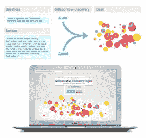

# 混合智慧实验室推出快速、可扩展的引擎，用于可视化客户洞察 TechCrunch

> 原文：<https://web.archive.org/web/http://techcrunch.com/2011/10/19/hybrid-wisdom-labs-launches-a-speedy-scalable-engine-for-visualizing-customer-insight/>

加州大学伯克利分校新媒体、机器人和工业工程教授肯·戈德堡，今天在三藩市 Web 2.0 峰会的舞台上推出了一个有趣的新创业公司，名为[混合智慧实验室](https://web.archive.org/web/20230205015100/http://hybridwisdom.com/main-site)。

据其创始人称，这家初创公司是从“加州大学伯克利分校十多年的机器人和社交媒体研究”中脱颖而出的，今天推出了其专利“协作发现引擎”，这是一种可扩展的方式，可供公司快速生成来自客户和员工的实时洞察力。戈德堡说，到目前为止，这项技术已经被通用汽车、联合利华、Humana 和美国国务院使用。

这位创始人说，这种新的协作引擎的想法源于这样一个事实，即大多数公司用来从社交媒体获取情报的工具最终都是基于列表的讨论界面，无法很好地扩展，并迅速发展到难以管理的程度。

 为了解决这个问题，发现引擎结合了来自头脑风暴、社交媒体和机器人技术的数千个想法，通过各种分析算法运行它们，然后以动态可视化格式呈现它们，使公司能够轻松发现哪些想法是重要的，以及他们应该将资源集中在什么地方。

价值主张:规模和速度。根据 Goldberg 的说法，该引擎可以扩展到支持成千上万的用户，而不会牺牲快速找到公司问题的最佳解决方案所需的速度。

从上图中可以看出，每个可视化都集中在一个关键主题上，例如，一个公司关于其产品或战略的问题。圆圈，或者真的是“绽放”，出现在视觉渲染(即图形地图)中，代表参与者提出的一个新的想法或回应。花朵彼此之间的相对位置基于观点(或想法)与志同道合者的相关性，花朵的颜色和大小代表该想法产生的“喜欢”或积极响应的数量。

用户使用代表两个维度的滑块(他们同意的程度和他们认为回答有多有见地)，然后评估这些回答，这可能会产生比社交媒体偏好评估中普遍存在的简单“赞成”或“反对”更强大的分析。

随着信誉算法处理进一步的响应，最不重要的想法逐渐消失在背景中，而更受欢迎的(或经常出现的)想法占据视觉优先地位，从而更深入地了解集体客户智能。

至于 beta 测试者是如何回应的？根据公司声明，[通过其网站](https://web.archive.org/web/20230205015100/http://hybridwisdom.com/static/hwl.pdf) : *发布:“2010 年 1 月，Hybrid Wisdom 与一家领先的财富 50 强制造商合作，寻找富有洞察力的解决方案，以提高他们的品牌和声誉。协作发现引擎吸引了 1，200 名最有价值的客户。几周后，最有价值的见解被反馈给公司，包括用户希望延长保修期以传达对质量和稳定性的信心。公司和参与者都非常高兴。在后续调查中，95%的用户表示他们“极有可能”再次参加“*”。

更多信息，[点击这里](https://web.archive.org/web/20230205015100/http://hybridwisdom.com/main-site)查看公司主页。让我们知道你的想法。