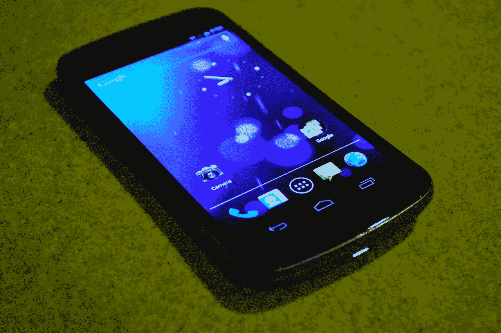

# 深入实践:Galaxy Nexus 和冰淇淋三明治(Android 4.0)TechCrunch

> 原文：<https://web.archive.org/web/https://techcrunch.com/2011/10/19/in-depth-hands-on-video-galaxy-nexus-and-ice-cream-sandwich-android-4-0/>

向你所知道的 Android 说再见吧。冰淇淋三明治(也称为 Android 4.0)即将到来，这是 Android 迄今为止最大的升级。

但是，花哨的新软件并不是谷歌一直在努力的唯一事情:他们还刚刚宣布了他们的新旗舰 Android 设备，三星制造的 Galaxy Nexus。我花了大量的时间在新硬件和新软件上，并带回了一大堆令人肃然起敬的第一印象、洞察力和你能在任何地方找到的最好的演示视频。

## 演示视频:

## 硬件

正如一群失业的 webOS 员工会告诉你的:没有好的硬件，好的软件什么都不是。

幸运的是，Galaxy Nexus 是——至少从我们目前所见——好的硬件。非常好。这可能是三星有史以来最好看的产品。以 Galaxy S II 响亮的固体设计为例，添加 Nexus S 显示屏的微妙曲线，再加上一些纤细的曲线，以便更好地衡量——*哒哒*！你有银河连接点。

从侧面看，星系 Nexus 就像一滴泪珠，从上往下逐渐变细，底部越来越厚。然而，与摩托罗拉 Droid X(甚至是刚刚发布的 [Droid RAZR](https://web.archive.org/web/20230205024536/https://techcrunch.com/2011/10/18/hands-on-verizon-droid-razr/) )尾部的“驼峰”不同，谷歌告诉我，更深的底座是为了人体工程学而设计的，而不是为了存储该设备最厚的组件。此外，与 Droid X 不同的是，Galaxy Nexus 的较宽部分不会影响设备的整体外观。

不过，我不喜欢机身的一部分:电池盖。与之前的许多三星产品一样，Galaxy Nexus 的电池盖是由一种手感粗糙的塑料制成的。你不会注意到，直到你拉下盖子…但一旦你这样做了，它只是有点粘着你。在今天早上看到机器人 RAZR 极其光滑的凯夫拉尔后部后，我的观点可能会有所动摇——尽管可以说 RAZR 的后面板是不可拆卸的。

三星一直在以极快的速度改进他们的 Super AMOLED 系列显示器，他们没有为这一款放松气体。1280×720 的高清分辨率(移动世界的第一个)和令人兴奋的 4.65 英寸，我不禁想知道:屏幕会不会太大了？

答案是否定的。在大多数情况下，它不会比现在相对常见的 4.5 英寸屏幕大。为什么？都是按钮的问题。以前的设备可能会放置电容式硬件按键，Galaxy Nexus 则放置了更多显示器。这些按钮成为屏幕本身的一部分，使屏幕在正常使用时看起来更舒适，只有在最有利于体验的时候(如视频播放时)，才扩展到 4.65 英寸(通过隐藏屏幕按钮)。)这个屏幕上的按钮诡计是冰淇淋三明治的可选产品，所以期待其他制造商立即采用它。

虽然我没有设法欺骗一个样本拍摄提供作为证据，该设备的前置和后置摄像头的质量似乎一般。我在一个光线相对较暗的房间里测试了这款设备，我既没有感到非常失望，也没有留下深刻的印象。

## 软件(安卓 4.0/冰淇淋三明治)

冰淇淋三明治是机器人，因为它应该是。

这是我第一次使用 Android，感觉谷歌已经接近了功能、灵活性、可用性和时尚美感之间真正的平衡。Android 一直很强大——只是它从来没有看起来那么好。冰淇淋三明治看起来不错。*真的*好。

奇怪的是，我从来不喜欢 Honeycomb，这是一款平板电脑的前身，冰淇淋三明治从它身上获得了如此多的视觉线索。蜂窝和冰淇淋三明治都有一个普遍的黑色主题。延伸到平板电脑的显示屏上，黑暗会给人一种压抑、空虚的感觉。然而，在智能手机的较小显示屏上(将 4.65 英寸的显示屏归类为“较小”是很奇怪的)，它是*夏普*。我也对对称情有独钟，手机上集成电路的中心对齐图标(相对于蜂窝平板电脑上的侧对齐图标)*看起来更好看*。

**冰淇淋三明治的优良特性:**

*   widgets 系统已经被彻底改造，主要的新功能是可调整大小。例如，Gmail 小工具可以缩放，一次只显示两封最近的电子邮件，或者通过短暂按住小工具并快速拖动边缘标记，最多显示三封或四封。
*   你终于可以在设备上截取**截图**了。除了一些手机被制造商黑进了截图功能，在 Android 上抓取屏幕通常需要在你的电脑上安装一个大规模的 SDK，并学习如何使用这些工具。
*   **浏览器**得到了彻底的改进。它有常见的错误修复和性能增强，但现在还允许您保存页面以供离线阅读，并且只需点击一下就可以请求任何页面的非移动版本(大概是通过一点用户代理的诡计)。
*   这个**新相机**真的是，*真的是*快。快门延迟是不存在的，它可以在不到一秒的时间内拍摄另一张照片。我很想在 Galaxy Nexus 的相机和 iPhone 4S 的相机之间进行一次快速拍摄。
*   **语音转文本引擎**已经被彻底改造，速度非常快。您说话自然，流式语音到文本转换应该只比您的单词落后几个音节。你必须亲眼目睹才会相信(请看上面 2:31 标记处的视频)。
*   同样值得一看的(上图 9:25):人脸识别锁**。Android 需要几秒钟来分析你的面部结构——一旦配置完毕，你的马克杯是该设备唯一可以解锁的。在光线较暗的情况下(相机可能无法很好地看到您)，您可以退回到刷卡模式(ICS 要求您在配置面部检测时设置)。**
***   要创建一个**文件夹**，你现在只需将一个应用程序拖到另一个之上。应用程序现在也可以被拖入和拖出静态 dock 区域，而无需通过设置跋涉。*   他们安装了一个相当有才华的**照片编辑**工具，从缩放/裁剪到基本的照片滤镜，应有尽有。它不是 Photoshop，但它可能会让你坚持到 Instagram 转向 Android。*   暂时来说，有一个小东西可能是我最喜欢的:T4 数据使用监视器 T5。通过在图表上快速拖动几个滑块，您可以快速浏览数据使用的时间线，并缩小哪些应用程序是吞噬数据的罪魁祸首。还有一个栏可以让你为你的数据使用设置自动警告触发器，而最后一个栏可以让你设置一个点(比如说，比你的每月限额少半兆)，在这个点上你的数据连接会自动关闭。作为一个每个月都被数据过剩困扰的人，我喜欢它。**

 **冰淇淋三明治很漂亮。它是抛光的。它是动态的，闪亮的，充满了渐变和半透明。

它不是——至少还不是——完美无瑕的。到处都有撞击声，有那么一两个紧张的时刻，滑球就是…不动了..工作。谷歌很快指出，我看到的是一个相对旧的版本——但即使不是，他们仍然有*周*时间来消除最初版本中挥之不去的错误，还有*个月*时间，人们才会真正期待冰激凌三明治会出现在各种设备上。他们会修好的。

这是一段时间以来我第一次从软件的角度对 Android 感到真正的兴奋，我期待着在未来看到更多的 ICS。当然，随着发布时间的临近，我们会给它一个全面的回顾，所以请保持警惕**