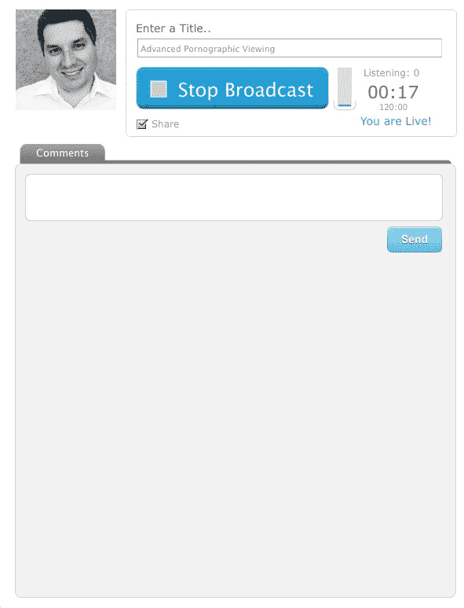
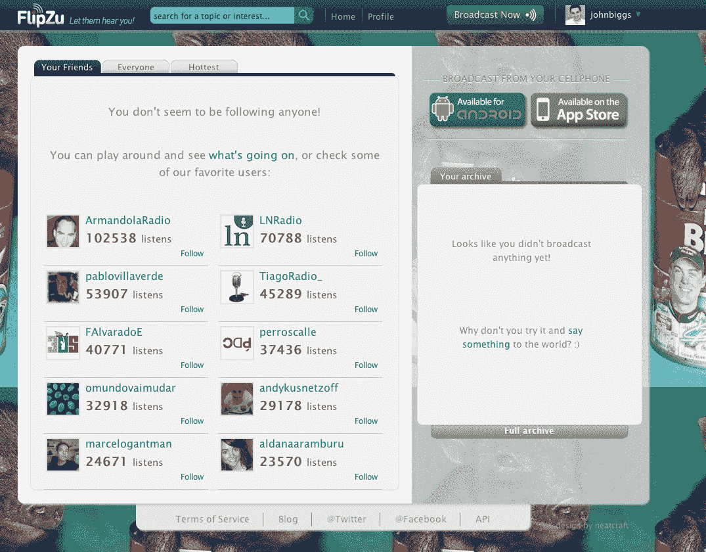

# 早上好，纳迪娜姆:FlipZu 让你成为即时播报员 TechCrunch

> 原文：<https://web.archive.org/web/http://techcrunch.com/2011/10/20/gooood-morning-nerdina/>

# 早上好，奈迪娜姆:FlipZu 让你成为即时播报员

你也可以像冷酷的哈利一样，从你汗臭的卧室的隐私里，向你修剪整齐的郊区鬼地方透露真相。责备那个人。抱怨校长。让联邦通信委员会盯着你(不完全是。)因为 [FlipZu](https://web.archive.org/web/20230203072921/http://flipzu.com/) 是来帮你建立自己的盗版电台的。

基于浏览器的应用程序(Android 和 iPhone 版本也可用)让你直播。基本就是这样。你按下一个按钮，执行麦克风检查，并开始抨击光明会和彼尔德伯格集团。人们可以听你的现场演唱，也可以听你以前的录音。

由总部位于阿根廷的[达里奥·拉皮萨尔迪](https://web.archive.org/web/20230203072921/http://flipzu.com/elvincha)和[卢卡斯·莱恩](https://web.archive.org/web/20230203072921/http://flipzu.com/lucaslain)创立。他们的[博客包括关于如何使用应用程序和一些软件建立一个广播电台的指导](https://web.archive.org/web/20230203072921/http://blog.flipzu.com/)(西班牙语)。

“一年多前，我和一个大学朋友自费创办了这个项目。达里奥说:“我们最近刚刚从一位当地投资者那里获得了 15 万美元的小额私人投资，所以我们成立了公司，并且很快就会再雇佣几个人。

当被问及产品是否会在有毛的情况下伸缩时，达里奥写道:

“在活动中使用它不会有任何问题。厄瓜多尔总统科雷亚经常使用这个平台发表演讲，巴西前总统卢拉也使用过这个平台，这个城市最受欢迎的广播节目之一每天都在使用这个平台，”他说。

“在不寻常的高流量情况下，该平台将扩大规模(我们在亚马逊上，流媒体平台是从零开始构建的，并考虑到了 EC2
)。”

这个想法并不新鲜。BlogTalkRadio 已经这样做了一段时间，尽管他们一直专注于记录和传输的呼叫方法。FlipZu 目前在媒体可用性和下载方面也相当有限，尽管你可以为你的记录创建一个 RSS 提要，从而为各种媒体播放器创建一个播客提要。这可能是一个在活动中进行现场采访和秘密录制苹果新闻发布会的好方法。

我测试了几次[这里](https://web.archive.org/web/20230203072921/http://flipzu.com/johnbiggs)一旦我准备好开始记录我每晚凌晨 2 点到 5 点之间的生存主义者咆哮，直到美国老人从月球返回地球，我会让你们知道。