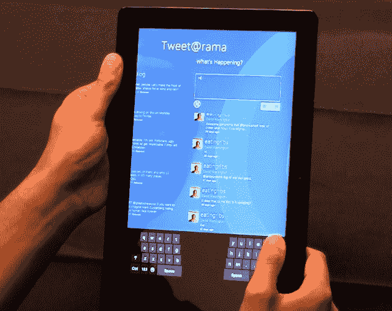

# 微软谈论 Windows 8 的纵向模式 TechCrunch

> 原文：<https://web.archive.org/web/http://techcrunch.com/2011/10/20/microsoft-talks-portrait-mode-for-windows-8/>

大多数人现在认为 Windows 8 是微软在平板电脑方面的重大努力。但我想知道它是否会比传统的笔记本电脑和台式机安装在更多的平板电脑上。毕竟，这不仅仅是 Windows 7 平板电脑版，而是 Windows 的下一个版本。

但是平板电脑系统有一个必须解决的问题，这个问题在笔记本电脑上很少出现:定位。虽然很少有人在纵向模式下使用他们的显示器，但在平板电脑上这样做非常普遍。许多应用程序和网页在垂直显示时效果更好。到目前为止，这对于平板电脑界面来说还算正常，但是开发一个大多数用户都不会遇到的东西肯定会让人有点沮丧。[尽管如此，这件事还是必须做，而且他们似乎做得很好](https://web.archive.org/web/20230203080336/http://blogs.msdn.com/b/b8/archive/2011/10/20/optimizing-for-both-landscape-and-portrait.aspx)。

Metro 界面的风格化外观意味着重做一些应用程序不是一件小事，但他们了解使用场景并让事情正常工作。我喜欢在纵向模式下为拇指工作优化的东西，因为在这种情况下你更有可能用双手握着它(而不是坐在支架或桌子上，当它更有可能在横向模式下)。

但是我不太同意这种观点:

> 我们收到了关于 Windows 8 是“横向优先”还是“纵向优先”的问题和反馈我们的观点是，纵向和横向都很重要，任何方向的体验都很棒。我们没有选择优化的姿势和方向，而是设计了一种无论如何握持都有意义的体验，一种为应用程序及其内容量身定制的体验。

虽然选择当然应该被允许，但他们似乎被禁止做出一些强有力的设计决策，因为他们拒绝在这个问题上表明立场。我不是说每个应用程序都应该被锁定在一个方向上，但同时，我认为假装一些应用程序在这个或那个方向上不会更好地工作是没有用的。但话说回来，没有考虑用户的偏好，如果人们试图将他们最喜欢的应用程序翻转过来，但得到的提示是这是不可能的，他们可能会感到沮丧。

即使体验“更差”，这也是一个不能忽视的用户选择。这是苹果愿意做出的限制，但微软不会(除非他们不得不)——这是两个设计流派，各有各的优势。

在帖子中，他们还透露，支持 Windows 8 所有 UI 功能(多任务处理、魅力等)的最低分辨率将是 1366×768。照目前的情况来看，用不了多久，5 英寸的屏幕就能容纳这么多像素。确切地说，我不确定我是否想要那样，但这是个有趣的想法。