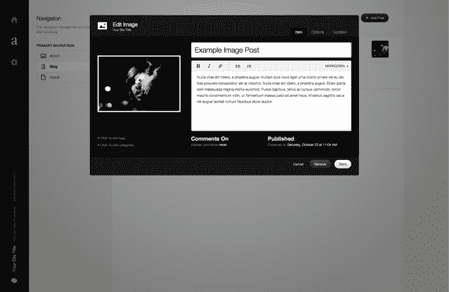

# Squarespace 6:彻底重建，挑战 WordPress、Tumblr 和其他所有人 TechCrunch

> 原文：<https://web.archive.org/web/http://techcrunch.com/2011/10/21/squarespace-6-rebuilt-from-the-ground-up-to-take-on-wordpress-tumblr-and-everyone-else/?utm_source=feedburner&utm_medium=feed&utm_campaign=Feed%3A+Techcrunch+(TechCrunch>)

所以你想建一个网页。也许是博客。也许这是一个为你的小企业服务的网站。也许这是你艺术作品的作品集。

在任何情况下，你都有选择。其中有很多，包括 WordPress、Movable Type、Tumblr、Virb、Weebly，以及各种迎合特定使用案例和社区的利基网站。

2010 年夏天，高端博客平台 Squarespace 筹集了 3850 万美元的巨额资金，它即将与所有这些公司展开较量。

今天，该公司推出了 Squarespace 6——一个完全重新设计的平台版本，它有足够大的雄心来证明其充足的资金。该服务的新版本目前处于严格的朋友和家人私人测试阶段，但随着未来几周更广泛的开放，它让用户第一次看到了他们可以期待的东西。看起来不错。

[维梅奥·http://vimeo.com/30922118 w = 630 & h = 400]

就创业公司而言，Squarespace 相对来说比较古老。该公司成立于 2003 年 4 月，当时创始人兼首席执行官安东尼·卡萨莱娜(Anthony Casalena)开始编写他的网站生成器的第一个版本(第二年春天推出)。几年后，他终于多雇了几个人，并组建了一个总共约 6 人的团队——由于该服务的高级订阅，运营费用高达数百万美元。

然后，在 2010 年 7 月，该公司决定做一些完全不同的事情:它筹集了由 Accel 和 Index Ventures 牵头的一轮[3850 万美元](https://web.archive.org/web/20230205000805/https://techcrunch.com/2010/07/13/squarespace-raises-38-5-million-from-accel-index-ventures/)的资金。这是该公司的第一笔外部投资，除了 Squarespace 刚起步时卡萨莱娜的父亲投资的 3 万美元。“我们决定尝试一下，”卡萨莱娜解释道。

今天的发布代表了这一轮融资的首批成果。在筹集到资金后，公司开始雇佣更多的人才——现在有 63 名员工，并且增长迅速。卡萨莱娜说，在这场招聘热潮开始后不久，一群 Squarespace 设计师召开了一次会议，以确定他们理想中的网站应该是什么样的，不依赖于现有的工具。然后，他们试图找出利用 Squarespace 现有的面向消费者的平台来建立这些网站的可能性。

他们的结论？不是的。

这就把我们带到了今天。在过去的一年里，该公司从零开始重建了它的技术，希望它既非常灵活，又易于使用，目标是让这些设计师(和消费者)建造他们想要的任何东西。

澄清一下，我还没用过它。但是卡萨莱娜确实向我展示了一个扩展的演示，看起来非常有希望。而且，和当前版本一样，Squarespace 仍将是一项仅提供高级服务的服务，计划每月收费 12-40 美元，但他表示，更直接的定价计划将很快公布。

Squarespace 的核心是围绕模板构建的，每个模板都是使用各种构件小部件构建的:文本、图像和其他常见的网页元素。博客模板以逆时间顺序呈现文本和图像块；图像组合模板将您的图像放在最显眼的位置，等等。如果这个系统听起来很简单，那是因为这是重点。

首先，该网站将只提供侧重于投资组合的模板。用户将能够使用直观的字体、颜色和每列大小控制器来调整这些标准作品集的布局，因此即使是相同的模板在每个网站之间看起来也不会太相似。

Squarespace 将迅速增加可用的模板类型——不难想象小企业、个人和专业博客甚至餐馆的模板(Squarespace 已经在平台的第 5 版上为这些用例提供了许多模板)。

开发者也可以从头开始构建自己的模板，然后一次性卖给他们的客户。Casalena 不愿证实允许开发者向其他用户出售他们的模板的网络商店正在建设中(Tumblr 已经在这方面取得了成功)，但这似乎是一个明显的进步。

从某些方面来看，Squarespace 似乎正在对其工具采取苹果式的方法。它不仅仅是所见即所得——它是一个非常好用的编辑器。界面非常干净，有时甚至很漂亮，而且有很多微妙的细节。例如，作品集模板会提供最适合观众浏览器尺寸的图片——如果他们全屏显示，他们会得到一个高分辨率的版本；如果它更小，他们会得到一个缩小的版本(加载速度会更快)。如果你调整浏览器的大小，Squarespace 会即时提供合适的图片版本。如果你不是在寻找它，你可能不会注意到，但它做得很好。

另一个非常漂亮的新特性是基于网格的动态布局系统。这有点难以描述，但上面的嵌入视频很好地展示了这一点。简而言之，你可以拖放任何内容——无论是一段文字、一张照片、一张地图等等。—页面上您想要的任何位置，其他所有内容都会调整大小并移动以适应它。更好的是，最终你将能够在每个帖子的基础上调整这些设计，这意味着混合你的帖子的布局比在 Tumblr 和 WordPress 上看到的设计更容易。

最终，这个新平台仍处于早期阶段，很难说这种承诺的灵活性和易用性在实践中是否真的有所作为。但是我很喜欢它的发展方向，并且一有机会就打算在我的个人博客上尝试一下。

