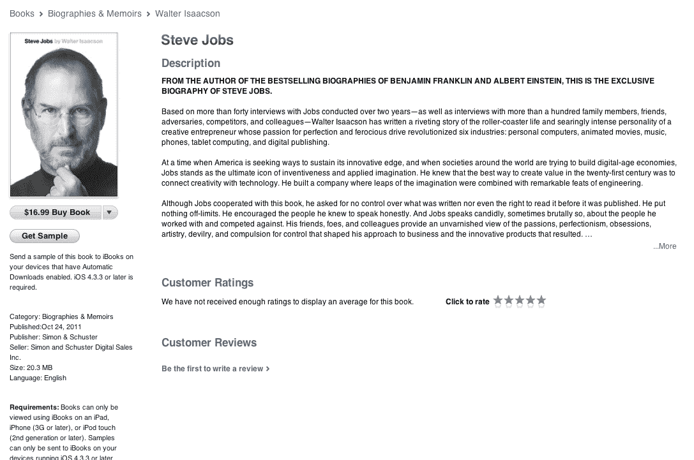
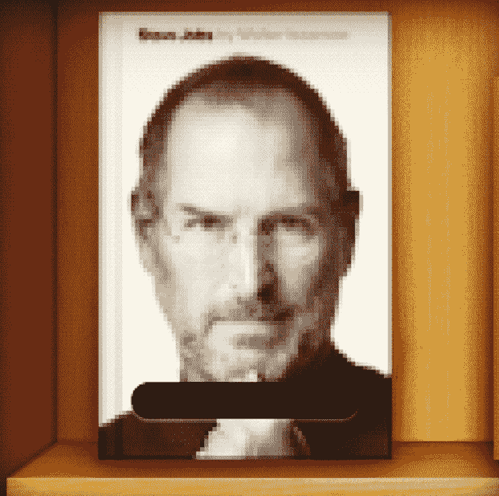

# 史蒂夫·乔布斯传记现已在 Kindle 和 iBooks TechCrunch 上发布

> 原文：<https://web.archive.org/web/http://techcrunch.com/2011/10/23/steve-jobs-bio-delivered-early-to-kindle-owners/>

# 史蒂夫·乔布斯的传记现在可以在 Kindle 和 iBooks 上找到

似乎整个《史蒂夫·乔布斯传》的事情已经不能再拖长了，也不能再戏剧化了，用户们——包括[杰夫·贾维斯](https://web.archive.org/web/20230203094426/https://twitter.com/#!/jeffjarvis/status/128288250279378944)和[杰森·科特基](https://web.archive.org/web/20230203094426/http://kottke.org/11/10/steve-jobs-authorized-bio-now-available-on-kindle)——报告说沃尔特·伊萨克森备受期待的[书提前交付了，奇怪的是通过亚马逊 Kindle 上的预购。这给苹果粉丝留下了一个难题；现在看《60 分钟》is aacon](https://web.archive.org/web/20230203094426/https://techcrunch.com/2011/10/22/spoiler-alert-steve-jobs-enjoyed-many-types-of-tea-book-says/)[访谈](https://web.archive.org/web/20230203094426/http://www.macrumors.com/2011/10/23/the-full-walter-isaacsonsteve-jobs-interview-from-60-minutes/)还是先看他的书？

在你对亚马逊触发器感到高兴之前，我刚刚试图通过 Kindle 订购一个，它还没有出现——所以也许它是先到先得的？

**更新:**我在 Kindle 上的副本刚到，在我订购 15 分钟后。而且，正如所料，这本书——包括免费样本——现在可以在 iPhone 和 iPad 上的 iBooks[中买到，无需等待。](https://web.archive.org/web/20230203094426/http://itunes.apple.com/us/book/steve-jobs/id431617578?mt=11)

这本 656 页的书的模拟版将于明天在全美书店正式发售。

*图片 via/ [强尼·曼扎里](https://web.archive.org/web/20230203094426/http://instagr.am/p/RQsgK/)*