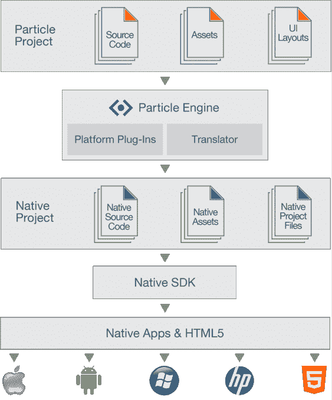

# Appcelerator 获得粒子代码，帮助开发人员为任何移动设备开发游戏和应用 TechCrunch

> 原文：<https://web.archive.org/web/http://techcrunch.com/2011/10/24/appcelerator-acquires-particle-code-to-help-devs-build-games-for-any-mobile-device/?utm_source=feedburner&utm_medium=email&utm_campaign=Feed%3A+Techcrunch+(TechCrunch>)

随着原生移动应用程序在多个不兼容的操作系统中继续流行，对能够同时部署在所有这些平台(和 web)上的强大开发工具的需求比以往任何时候都更加强烈。

因此，当这个领域的热门初创公司被抢购一空时，这并不奇怪。这正是今天早上刚刚发生的事情: [Particle Code](https://web.archive.org/web/20230203063512/http://www.particlecode.com/) ，一家让开发者同时为多个平台开发游戏和应用的公司，被直接竞争对手 [Appcelerator](https://web.archive.org/web/20230203063512/http://www.appcelerator.com/) 收购，后者是流行工具 Titianium 的制造商。收购价格尚未披露。

这笔交易是 Particle Code 核心开发团队的成果，也是该公司创始人加利亚·贝纳齐(Galia Benartzi)、约坦·沙查姆(Yotam Shacham)和玉笛·李维(Andrew Levi)16 个月前明智押注的结果。

回到 2010 年 6 月，这三人是社交游戏初创公司 Mytopia 的创始人，该公司被在线赌博公司 888 收购(Mytopia 曾在 2008 年 TechCrunch 50 上[推出](https://web.archive.org/web/20230203063512/https://techcrunch.com/2008/09/09/tc50-mytopia-wants-to-help-world-play-together/))。此次收购包括 Mytopia 开发的 12 款游戏，收购价格高达 4800 万美元，具体取决于这些游戏的表现。

但 Mytopia 没有出售一些东西:它为帮助自己制作这些游戏而建立的开发平台——他们意识到这可能比游戏本身更有价值。于是他们把游戏卖了，把开发平台授权给 888，然后把面向开发者平台剥离出来，作为自己的自举独立公司，粒子代码。该公司在 2010 年秋季的演示上推出(并获得了胜利)。

这就把我们带到了今天。市场上有几种将原生应用分发到移动平台的解决方案(即 iOS 和 Android，有时还有 Windows 和 Blackberry)。这是一个最近经历了大量整合的领域——Adobe 最近[收购了 PhoneGap 的开发者](https://web.archive.org/web/20230203063512/https://techcrunch.com/2011/10/03/adobe-acquires-developer-of-html5-mobile-app-framework-phonegap-nitobi/) Nitobi，后者可以将网络应用转化为本地应用。今天的新闻延续了最近的趋势。

Benartzi 说 Appcelerator 对粒子代码感兴趣有几个主要原因。最大的问题是该公司非常重视开发人员——14 名员工中有 12 名是工程师。他们的经验围绕着让游戏在多个平台上兼容。

Benartzi 解释说，从历史上看，Appcelerator 的钛产品在产生轰动效应和主要客户(包括 NBC、ZipCar、易贝等)方面做得非常好。但使用其工具开发的应用程序很少是游戏，部分原因是游戏对性能问题的容忍度很低(当你浏览基于文本的列表或静态图像时，你可以承受速度变慢，但游戏中抖动的图形可能会破坏交易)。Appcelerator 正计划利用粒子代码在这方面的专业知识，使钛更加游戏友好。

这是 Appcelerator 的明智之举:游戏已被证明是所有流行的智能手机平台中最受欢迎的应用程序，并可能证明非常有利可图，特别是如果它决定开始提供围绕应用内支付的订阅计划(目前 Appcelerator Titanium 提供面向企业的订阅计划，但这似乎是下一个合乎逻辑的步骤)。这些应用可以在 iOS 和 Android 上运行，*和*可以在网络上运行(这意味着你也可以部署在脸书或 Google+上)。

这是 Appcelerator 今年的第二次收购，此前[在一月份收购了](https://web.archive.org/web/20230203063512/https://techcrunch.com/2011/01/18/appcelerator-acquires-web-app-development-suite-aptana/) web IDE Aptana。该公司在过去一年中经历了一些巨大的增长——开发人员总数达到了 160 万人(12 个月前为 10 万人)，迄今为止为 iOS 和 Android 开发了 3 万个应用程序(同期为 5000 个)。

