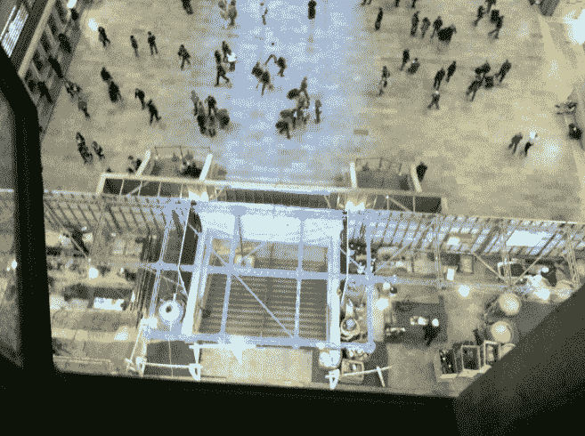

# 苹果即将开业的中央大商店将在黑色星期五前准备就绪 TechCrunch

> 原文：<https://web.archive.org/web/https://techcrunch.com/2011/10/24/apples-upcoming-grand-central-store-will-be-ready-by-black-friday/>

# 苹果即将推出的中央大商店将在黑色星期五前准备就绪

假期即将来临，就像其他品牌和零售商一样，苹果正在为抢购做准备。我们之前报道过的位于纽约标志性的中央车站的苹果商店将在今年的黑色星期五开放。

这个 15230 平方英尺的空间曾经是 Metrazur 餐厅的所在地，但后来因为施工被用墙隔开了。据 [PhoneArena](https://web.archive.org/web/20230203091944/http://www.phonearena.com/news/Grand-Central-Apple-Store-to-open-doors-for-Black-Friday_id23206?utm_source=feedburner&utm_medium=feed&utm_campaign=Feed%3A+phonearena%2FySoL+%28Phone+Arena+-+Latest+News%29) 报道，苹果员工已经在时代广场的一家酒店接受培训，培训将持续到 11 月 11 日。

9to5Mac 似乎获得了一张新空间的谍照，由一名 MTA 员工拍摄。值得注意的是，下图只显示了新店的一部分，它应该是世界上最大的苹果商店之一。

黑色星期五也是出了名的繁忙的旅行日，也是一年中最大的购物节日。看看大中央车站如何同时面对假日通勤者、黑色星期五购物者和苹果粉丝会很有趣。

