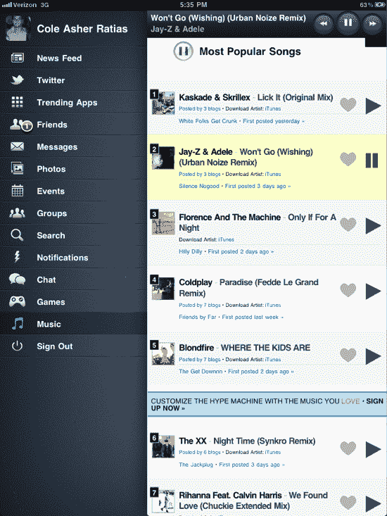

# MyPad 对脸书官方竞争对手不屑一顾，现在拥有 250 万日活跃用户 TechCrunch

> 原文：<https://web.archive.org/web/http://techcrunch.com/2011/10/24/mypad-shrugs-off-official-facebook-competitor-now-has-2-5-million-daily-active-users/>

# MyPad 对脸书官方竞争对手不屑一顾，现在拥有 250 万日活跃用户

10 月 10 日，近年来持续时间最长的科技谣言之一终于有了结果:脸书发布了自己的官方 iPad 应用程序。自 iPad 首次推出以来，这款应用的需求一直很高(毕竟，脸书的 iPhone 应用是该平台有史以来最受欢迎的应用之一)。但是在发布日没有 iPad 应用程序。iPad 2 发布的那天也没有。但这并没有阻止人们前往应用商店，输入“脸书”。

与此同时，一些有事业心的企业家借此机会推出了他们自己的非官方脸书 iPad 应用程序——数百万人最终下载了这些程序。其中之一是 [MyPad](https://web.archive.org/web/20230203094214/http://itunes.apple.com/us/app/mypad-for-facebook-twitter/id413419662?mt=8) (以前叫 FacePad)，自 1 月份首次推出以来增长强劲，提供照片、新闻提要和聊天等脸书功能，界面比该网站的网页版更光滑。从那以后，这个应用程序一直在稳步改进，最近推出了它的 [iPhone 应用程序](https://web.archive.org/web/20230203094214/https://techcrunch.com/2011/08/09/hit-ipad-facebook-app-mypad-comes-to-the-iphone/)。

或许更重要的是:尽管本月早些时候推出了脸书官方应用，但 MyPad 的使用率仍处于历史最高水平，并且还在增长。

制造 MyPad 的 Loytr 公司的创始人之一科尔·拉蒂阿斯(Cole Ratias)表示，自脸书推出官方 iPad 应用程序以来，这款应用程序已经增长了 25%，目前是脸书平台上第 15 大最受欢迎的应用程序。该应用程序现在拥有 250 万日活跃用户(一个月前约为 210 万)，其中 65%的人经常使用该应用程序。Ratias 表示，根据 AppData 的数据，这比脸书在其应用中看到的回头客高出 10-15%。

Ratias 承认，脸书官方应用推出后出现了下滑，新下载量也受到了影响，这在很大程度上是因为脸书官方应用在搜索结果和苹果“热门应用”列表中的排名更高。但参与人数显示，许多人坚持使用他们已经拥有的东西，Ratias 表示，许多新用户实际上试用了官方应用程序，想要一些不同的东西，然后转向了 MyPad。

也就是说，Loytr 要想留住这些用户并保持长期增长，就必须想办法让自己与官方应用区分开来。但它很清楚这一点。

昨晚，该公司推出了新版本的 iPad 应用程序(99 美分的版本已经上线，而免费版本正在等待苹果公司的批准)。在新的更新中，Loytr 继续集成脸书没有提供的新功能——除了 Twitter 集成，它现在还提供了一个趋势应用程序部分，展示用户安装到他们设备上的其他应用程序。该公司刚刚与 Hype Machine 达成协议，整合免费音乐。

