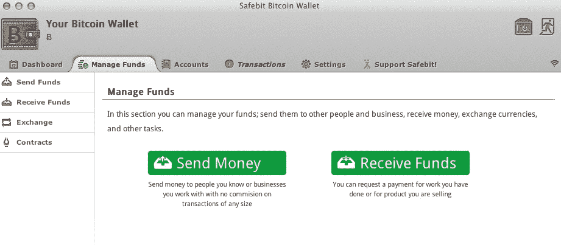

# 比特币的生意:企业家在替代货币中看到了机会 TechCrunch

> 原文：<https://web.archive.org/web/https://techcrunch.com/2011/10/24/the-business-of-bitcoin-entrepreneurs-see-opportunities-in-alternative-currencies/>

# 比特币的生意:企业家在替代货币中看到了机会

经过一些知名媒体的报道(和一些知名的 T2 的反对，比特币经历了一次崩盘，从 20 年代的高点跌至今天的 3 美元左右。然而，有趣的是，用户、实验者和企业家仍然支持这一运动的热情并没有减弱。

这个领域的赚钱之道在于为比特币系统创造一个智能界面。理论上，比特币交易应该是完全即时的、匿名的。该系统公开记录每一笔交易，确保比特币不能被反复使用，但观看记录不会告诉你任何关于执行交易的人的信息。正是这种匿名性使得像[丝绸之路](https://web.archive.org/web/20230203140214/http://www.gwern.net/Silk%20Road)这样的网站得以存在，这是一家网上药品和“替代产品”商店，提供 15 岁无政府主义者或普通吸毒者想要的一切，几乎在公开场合销售一空(尽管完全是匿名的)。然而，对于执法部门来说，跟踪现金进入比特币迷宫并在货物离开时跟踪它们是微不足道的。这既有好处也有坏处:坏处是因为比特币的支持者将政府的眼睛视为邪恶的工具，好处是因为它确保企业可以(但可能不会)开始接受比特币。

我探索了比特币的几种可能的实现方式，包括基于比特币的域名系统(DNS ownership system ),确保没有任何一个域名管理机构可以随意分配或重新分配域名——这对像迈克·罗伊这样的人来说是一个福音。遗憾的是，我发现，虽然挖掘的亚文化已经相当成熟，但这些工具对于普通用户来说是不透明的。这就是企业家介入的地方。

那么，普通人如何开始接受比特币呢？有许多界面，包括比特币支持者制作的开源应用，但像 [Safebit](https://web.archive.org/web/20230203140214/http://forums.safeb.it/) 这样的人也在努力简化这一过程。

“这是一个非常友好的钱包，所以非技术人员将能够自己使用它，而不是很难存储他们的比特币，”Safebit 联合创始人或佩雷尔曼说。

这些大多假设你不是在进行自己的比特币挖掘，而是想提供你的商品和服务来换取 BTC，这一过程对于普通商家来说就像接受贝宝一样熟悉。比特币实际上没有有形财富的支持，这一概念肯定会在很大程度上阻碍比特币的采用。例如， [LaCie 的 Wuala](https://web.archive.org/web/20230203140214/http://www.wuala.com/) 目前接受比特币作为他们的服务。

另一个有趣的——如果是衍生的——实现是被称为 Bitcoin^2 的东西，这是一种基于“通过自然能源等价交换——易货的一种变体”的比特币价值的服务这意味着什么谁也说不准，尽管创造者是背着神秘的比特币创始人中本聪的恶名，为了推出他们的 B2B 交易平台。如果没有一个中央权威，这些分支开花和枯萎的速度将大大加快。

就目前情况来看，比特币并没有消亡。有许多担忧，本·劳里在他的论文中解释了主要的担忧，“分散化的货币可能是不可能的(但至少让我们把它们变成 Efficient).的货币)”他写道:

> 比特币和我的替代方案都源于一个没有已知解决方案的问题:在一个成员开放且不断变化的群体中达成共识。但至少我的提议以能量 efficient 的方式失败了，不像比特币。

然而，如果说在互联网上有什么是容易的，那就是维护一个开放的、不断变化的群体。比特币一直被设计为一种概念验证，而不是真正的货币交易，人们可以从中提取现金是一个令人高兴的意外。因此，我们的目标是让比特币变得像银行间转账和账户间转账一样简单，并让消费者了解它的好处。最终，反对者可能不会被证明是错误的，但一个独立、开放、表面上安全的价值转移系统还是有一些社会价值的，不管是好是坏。