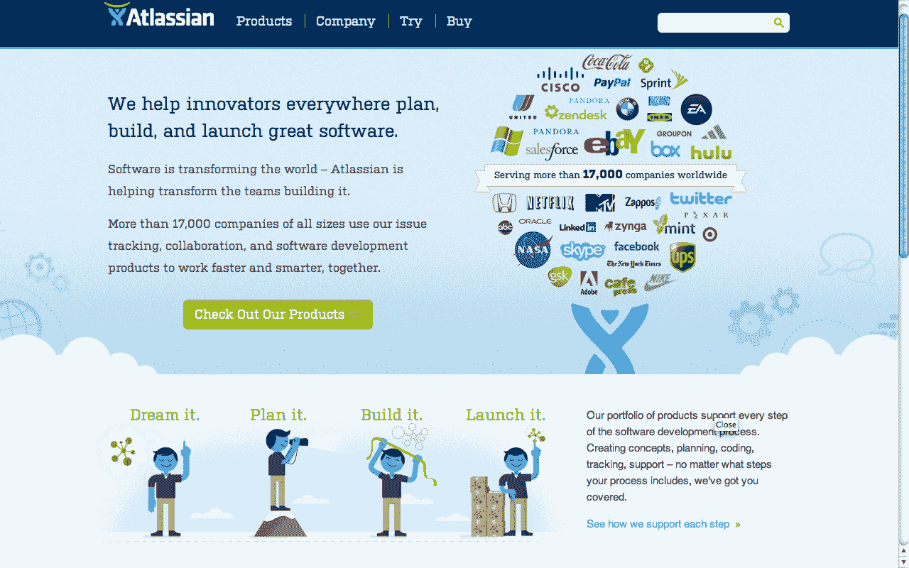

# 亚特兰蒂斯重新设计网站；针对产品开发推出单点 SaaS 服务 TechCrunch

> 原文：<https://web.archive.org/web/http://techcrunch.com/2011/10/25/atlassian-redesigns-website-launches-a-la-carte-saas-service-for-product-development/?utm_source=dlvr.it&utm_medium=twitter>

企业软件公司 Atlassian 在过去几年里取得了长足的发展。该公司于 2002 年在悉尼成立，如今已经拥有 26，000 名客户，其中包括一些知名公司，如脸书、Zynga、思科和 Adobe。去年 7 月，这家初创公司从 Accel 筹集了 6000 万美元，以扩大规模并扩大 M & A。从那时起，该公司购买了 Bitbucket 和 SourceTree，允许开发人员在 Bitbucket(或任何其他托管平台)上托管他们的源代码，然后使用 SourceTree 管理这些源代码。

从一开始，Atlassian 的目标就是创建软件开发和协作工具，使企业团队能够快速、轻松地规划、构建和发布产品。这家初创公司的旗舰软件产品，如 JIRA 和 Confluence，让软件开发团队利用问题和项目跟踪来努力提高开发速度和代码质量，并为这些团队提供一个单一的地方来协作、共享和讨论文件、会议记录、规格、模型、图表等。

根据 Atlassian 总裁 Jay Simons 的说法，该公司目前的年增长率为 40%，收入为 8800 万美元(高于去年的 5600 万美元)。在这一增长的基础上，该公司今天宣布了一系列升级和更新，这对全球客户来说应该是一个福音。首先，该公司已经搬进了位于旧金山第 7 街和哈里森街的新办公室，并且还将对其网站进行全面重新设计，该网站将于今天下午上线。

但除此之外，该公司今天将推出一项名为“Atlassian OnDemand”的 SaaS 新产品，该产品将允许软件开发团队以更低的折扣价使用该公司的产品(包括 JIRA 和 Confluence)。10 个用户每月 10 美元起，多租户、基于云的 SaaS 基本上允许其软件的用户利用其开发和协作产品，并具有易于配置的优势。

OnDemand 接管了 Atlassian Hosted(该公司自 2006 年以来一直在运营)，将使客户能够集成第三方应用程序，以增强其项目环境的功能、特性和多功能性。

但 OnDemand 的真正亮点在于它是按菜单点菜的，这意味着用户可以根据自己的需要开始或多或少的服务，并随着他们的发展添加产品。Atlassian 的应用程序被集成到当前的产品中，因此，当用户添加新产品时，标签会出现在他们屏幕的顶部。应用程序之间也可以共享链接，共享导航，以及系统之间的共享。OnDemand 包括 JIRA、Confluence、GreenHopper、团队日历、Bonfire、FishEye、Crucible 和 Bamboo，以及所有应用的免费维护和升级，以及与 Google Apps、Zendesk、Salesforce、uTest 等的第三方兼容性。

因此，通过混搭按需服务，客户可以挑选每个应用程序所需的用户数量，起价为每月 10 美元，并以此为基础进行扩展。[你可以在这里查看分级定价](https://web.archive.org/web/20230204112945/http://www.atlassian.com/software/ondemand/pricing)。现在，对于 Atlassian 的客户来说，无论他或她购买了什么，他们都能够利用工作室风格的集成、单点登录、统一用户管理、链接、通用导航等，这非常酷。

[这里有更多关于新亚特兰蒂斯的信息](https://web.archive.org/web/20230204112945/http://www.atlassian.com/)。

