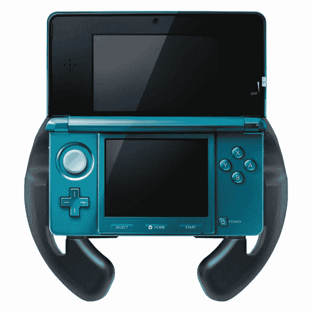
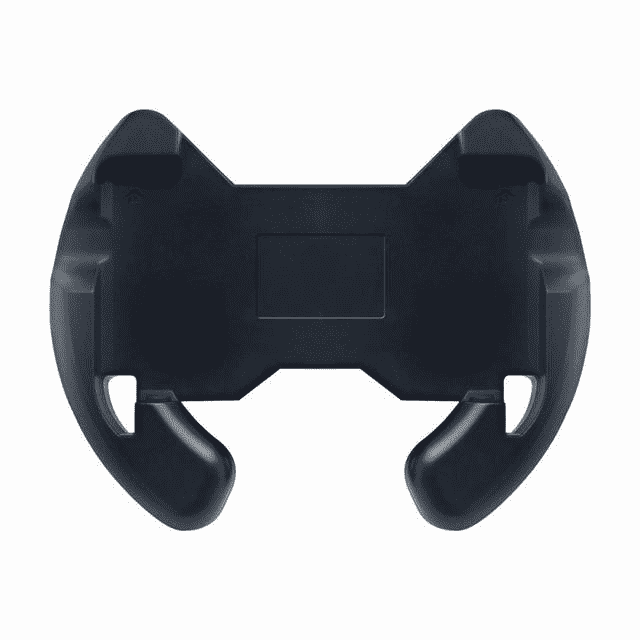
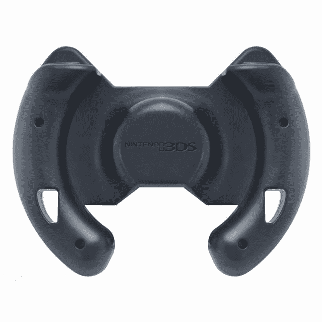

# Hori 在 3DS TechCrunch 上发布马里奥赛车的方向盘外设

> 原文：<https://web.archive.org/web/http://techcrunch.com/2011/10/25/hori-steering-wheel-3ds/>

# Hori 宣布 3DS 上马里奥赛车的方向盘外设

即将推出的 [3DS](https://web.archive.org/web/20230205042809/https://techcrunch.com/tag/3ds/) 上为《马里奥赛车 7》的未来所有者准备了一个非常特殊的外设，但它不是由[任天堂](https://web.archive.org/web/20230205042809/https://techcrunch.com/tag/nintendo)自己制造的:视频游戏配件制造商 [Hori](https://web.archive.org/web/20230205042809/http://www.hori.jp/global.htm) 宣布了一个专门为游戏设计的方向盘，并得到了 big N 的官方许可

该设备将配备大型 L 和 R 按钮，以便更好地控制:

堀表示方向盘，也就是日本——仅在这一点上，会在《马里奥赛车》上市时(12 月 1 日)发布。它的售价将为 17 美元，在日本以外还没有发布日期(所以你可能想尽快联系你的进口商店)。