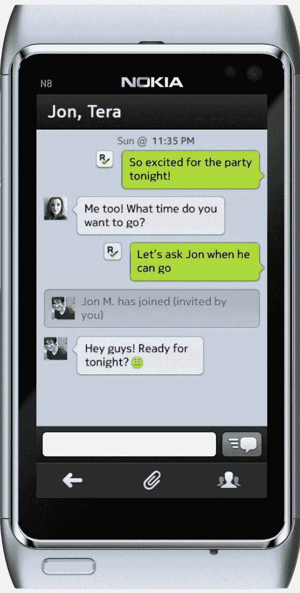

# Kik 在诺基亚世界 TechCrunch 上推出新的 Symbian 和 Windows Phone 消息应用

> 原文：<https://web.archive.org/web/https://techcrunch.com/2011/10/25/kik-debuts-new-symbian-windows-phone-messaging-apps-at-nokia-world/>

# Kik 在诺基亚世界推出新的 Symbian，Windows Phone 消息应用

独家-[Kik](https://web.archive.org/web/20230203073807/http://www.crunchbase.com/company/kik-interactive)今天在伦敦诺基亚世界大会上发布了新的 [Symbian](https://web.archive.org/web/20230203073807/http://symbian.nokia.com/) 和 [Windows Phone](https://web.archive.org/web/20230203073807/http://www.microsoft.com/windowsphone/en-us/default.aspx) 应用。

漂亮的[跨平台消息应用](https://web.archive.org/web/20230203073807/https://techcrunch.com/2010/11/08/kik/)正在 Symbian 上首次亮相，尽管是在[私人测试版](www.kik.com/symbian)，Windows Phone 7 已经专门针对 7.5 版本(Mango)进行了更新和重新设计。

另见:[Kik 为什么爱 Windows Phone 7(剧透:它助推了 Android 和 iOS 用户增长)](https://web.archive.org/web/20230203073807/https://techcrunch.com/2011/08/30/why-kik-loves-windows-phone-7-spoiler-it-boosts-android-and-ios-user-growth/)

Kik Messenger 应用程序背后的羽翼未丰的公司也可用于 iOS、Android 和黑莓，因此将一举将其可用性扩展到全球使用的几乎所有五大移动平台。

特别是 Symbian 应用程序，旨在扩大 Kik 在新兴市场和该平台仍受欢迎的地区的影响力。

目前处于私人测试阶段，Symbian 应用程序支持发送、交付和阅读通知，与所有支持平台上的任何 kik 用户进行群聊，以及照片共享。

与此同时，Windows Phone 应用程序的 2.0 版本利用了芒果的新功能，增加了快速应用程序切换、列表滚动、通讯录联系人匹配和其他改进。

这是 Symbian 应用程序的外观:

