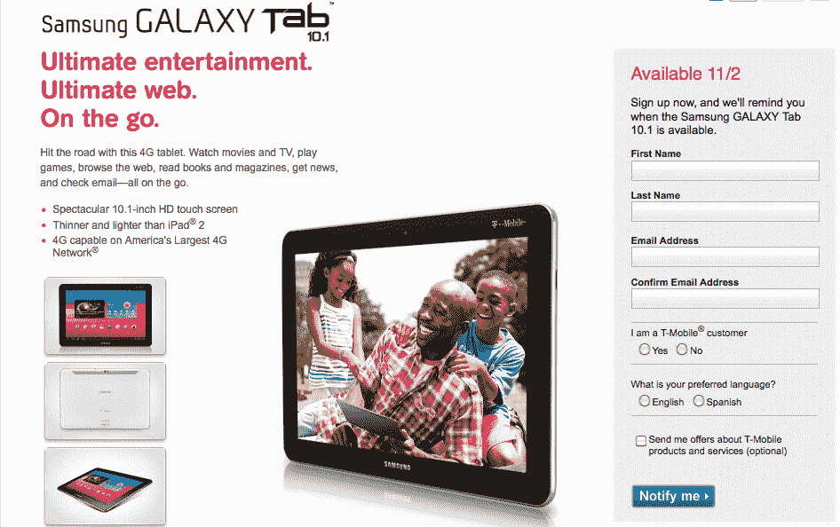

# 三星 Galaxy Tab 10.1 的 t-Mobile out 发布日期，华为跳板 TechCrunch

> 原文：<https://web.archive.org/web/https://techcrunch.com/2011/10/25/t-mobile-outs-release-dates-for-the-samsung-galaxy-tab-10-1-huawei-springboard/>

# 三星 Galaxy Tab 10.1、华为跳板的 t-Mobile out 发布日期

如果你已经看上了 Galaxy Tab 10.1 或华为的新跳板平板电脑，这两款设备的注册页面刚刚在 T-Mobile 的网站上弹出。11 月 7 日，你将能够以不超过 200 美元的价格买到一个新的跳板。我们还不清楚确切的价格，但 TmoNews 似乎认为两年合约的价格为 179.99 美元。另一方面，三星 Galaxy Tab 10.1 将于 11 月 2 日与一批[其他手机](https://web.archive.org/web/20230203152006/https://techcrunch.com/2011/10/05/leaked-t-mobile-roadmap-promises-six-new-devices-on-november-2/)一起上市。

至于 GalTab 的定价，事情仍然是一个谜。Wifi 版的价格在 499 美元到 599 美元之间，所以两年的协议可以将价格降至 299 美元或 399 美元左右。但是我们必须等待官方消息来确定。

三星的 Galaxy Tab 10.1 配备了 10.1 英寸 1280×800 WXGA 液晶显示屏，300 万像素的后置摄像头可用于 720p 视频拍摄，200 万像素的前置摄像头可用于视频聊天。slate 在 1GHz 双核处理器上运行 Android 3.2 Honeycomb，有 16GB、32GB 和 64GB 三种内存选项。

华为的跳板平板电脑是一个 7 英寸的小标签，采用 Android 3.2 蜂巢技术。在引擎盖下，你会发现一个 1.2GHz 的双核处理器，背面有一个 500 万像素的后置摄像头(720p 视频捕捉)，还有一个 130 万像素的前置摄像头，用于视频聊天。这两款平板电脑都支持 Adobe Flash。

如果你想了解这两款平板电脑的更多信息，点击[这里](https://web.archive.org/web/20230203152006/http://mobile-broadband.t-mobile.com/tablets/galaxy-tab/10-1)了解三星 Galaxy Tab 10.1，点击[这里](https://web.archive.org/web/20230203152006/http://mobile-broadband.t-mobile.com/tablets/springboard)了解 T-Mobile 跳板。